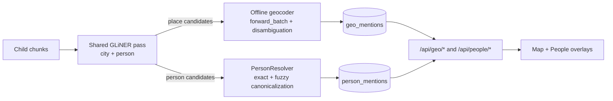

## Project: Corpus Offline RAG Application (Apple Silicon Optimized)

## 1. Core Architecture Overview

The application is a **full-stack offline RAG system** designed for local-first document analysis on Apple Silicon. All inference runs on-device via MLX -- no cloud APIs, no internet required after initial model download.

**Components:**

- **FastAPI backend** (`src/api.py`) -- REST + SSE streaming for ingest, source management, query, freeform chat, and transcription
- **Next.js frontend** (`frontend/`) -- dual-mode UI (RAG + Freeform) with modular layout components, source management, map/people overlays, citation viewer, session history, and speech-to-text
- **Decoupled RAG engine** (`src/rag_engine.py`) -- shared by CLI and API, orchestrates the full query/ingest pipeline
- **Hybrid retrieval pipeline** (`src/retrieval.py`) -- LanceDB ANN + BM25 FTS with RRF fusion, Jina v3 reranking, intent-scaled parameters
- **MLX inference stack** -- generator (`src/generator.py`), embeddings (`src/embeddings.py`), reranker (`src/reranker.py`)
- **Mode-aware configuration** (`src/config.py`) -- RAM-based auto-scaling across operating modes with per-intent retrieval and generation overrides
- **Entity indexing pipelines** (`src/geocoder.py`, `src/ner.py`, `src/person_resolver.py`) -- ingest-time place and person NER with offline geocoding and canonical person matching
- **People dictionary UX** (`frontend/src/components/people/PeopleDictionary.tsx`) -- canonical person browsing, mention inspection/deletion, and merge operations
- **Phoenix/Arize observability** (`src/phoenix_tracing.py`) -- OpenTelemetry tracing across ingest/query/freeform with trace ID propagation and feedback annotations
- **Inline academic citations** -- source-grounded responses with chunk-level references and post-hoc citation verification

---

## 2. Technology Stack

| Layer | Technology | Notes |
|-------|-----------|-------|
| LLM Inference | `mlx-lm` (Metal-native) | KVCache support, streaming, thinking-block filtering |
| Embeddings | `mlx-lm` via `MlxEmbeddingModel` wrapper | Last-token pooling (decoder architecture), left-padding, instruction-prefixed query encoding |
| Re-ranking | `jinaai/jina-reranker-v3-mlx` | Listwise MLX-native reranker (Qwen3-0.6B backbone) |
| Intent Classification | Heuristic-first + `mlx-lm` LLM fallback | 12 intents, regex + structural signals, LFM2 fallback |
| Storage | `lancedb` + `pyarrow` | Vector ANN + FTS hybrid search with native RRF |
| Backend API | `fastapi`, `uvicorn`, `python-multipart` | SSE streaming (AI SDK v6 UI Message Stream) + multipart upload |
| Frontend | `next.js 16` (App Router), React 19, TypeScript 5 | Tailwind CSS 4, `@assistant-ui/react`, `@ai-sdk/react`, MapLibre map overlay |
| Geospatial + People | `GeoNames` + `rapidfuzz` + `gliner` + in-process person resolver | Offline place geocoding + canonical person indexing for map and people dictionary overlays |
| Observability | `arize-phoenix-otel` | OpenTelemetry tracing + Phoenix export/runtime status |
| Speech-to-Text | `mlx-whisper` | Offline transcription with VAD |
| PDF Extraction | `PyMuPDF`, `pypdf`, `pdfminer.six`, `pytesseract` | Quality-first, per-page fallback chain |

---

## 3. Model Stack

All modes share the same three-model stack. No model varies by mode -- differentiation comes via retrieval depth, token budgets, prompt instructions, and sampling parameters.

| Role | Model ID | Details |
|------|----------|---------|
| **LLM** | `NexVeridian/Qwen3.5-35B-A3B-4bit` | Qwen3.5 35B MoE (3B active), 4-bit quantized. Supports `enable_thinking` template parameter for chain-of-thought. |
| **Embedding** | `mlx-community/Qwen3-Embedding-0.6B-4bit-DWQ` | Qwen3 0.6B decoder backbone, 4-bit DWQ. Loaded via `mlx_lm.load()`. Uses last-token pooling, left-padding, and instruction-prefixed query encoding. |
| **Reranker** | `jinaai/jina-reranker-v3-mlx` | Qwen3-0.6B backbone (28 layers, 1024 hidden) + MLP projector (1024→512→512). Listwise cosine similarity scoring. |
| **Intent LLM** | `mlx-community/LFM2-8B-A1B-4bit` | LFM2 8B MoE (1B active), 4-bit. Used when heuristic intent confidence < 0.70. |
| **Whisper** | `mlx-community/whisper-large-v3-4bit` | Via `mlx-whisper`. Lazy-loaded on first transcription request. |

---

## 4. Module Map

### 4.1 Data Models (`src/models.py`)

Hierarchical chunk structure for retrieval efficiency and context expansion:

- **`Metadata`** (frozen, `extra="forbid"`) -- `source_id` (required), `parent_id` (optional), `page_number` (optional, ≥1), `page_label` (optional), `display_page` (optional), `header_path` (required)
- **`ParentChunk`** (frozen) -- ~1000-1500 tokens, full paragraph context; UUID-based `id`, `text` (min_length=1), `metadata`
- **`ChildChunk`** (frozen) -- ~200-300 tokens, overlapping retrieval units; references parent via `metadata.parent_id`

All dataclasses are frozen (immutable) with UUID generation at creation.

### 4.2 Storage Engine (`src/storage.py`)

Unified LanceDB-backed storage managing five table types:

| Table | Purpose | Key Columns |
|-------|---------|-------------|
| `child_chunks` | Vectors + FTS, hybrid-searched | `id`, `text`, `vector`, `source_id`, `parent_id`, `page_number`, `header_path` |
| `parent_chunks` | Parent text for context expansion | `parent_id`, `source_id`, `text`, page metadata |
| `source_summaries` | Per-source metadata (schema v4) | `source_id`, `summary`, `source_path`, `snapshot_path`, `citation_reference`, `page_offset` |
| `geo_mentions` | Ingest-time geocoded mentions for map UX | `id`, `source_id`, `chunk_id`, `place_name`, `geonameid`, `lat`, `lon`, `confidence`, `method` |
| `person_mentions` | Ingest-time canonical person mentions for People Dictionary UX | `id`, `source_id`, `chunk_id`, `raw_name`, `canonical_name`, `confidence`, `method`, `role_hint` |

**`StorageConfig`:** `lance_dir` (default `data/lance`), `lance_table` (default `child_chunks`), `fts_rebuild_policy` (default `immediate`), `fts_rebuild_batch_size` (default 0)

**Key capabilities:**
- Native hybrid search (vector ANN + BM25 + RRF) via single LanceDB call with auto-retry on FTS rebuild
- FTS index management with configurable rebuild policies (`immediate`, `deferred`, `batch`)
- Automatic schema migration for summary columns (`source_path`, `snapshot_path`, `citation_reference`, `page_offset`)
- Geo-mentions schema migration and best-effort scalar indexes (`source_id`, `confidence`, `geonameid`)
- Person-mentions table creation + best-effort scalar indexes (`source_id`, `canonical_name`, `confidence`)
- Person mention CRUD support (`upsert`, filtered query, delete by mention/source, canonical merge)
- SQL-safe literal escaping via `_escape_sql_literal()` and chunked IN clauses (max 256 values per clause)
- `_row_to_metadata()` helper for consistent metadata extraction across all query paths
- Safe upsert for parents with backup/rollback on failure
- Embedding dimension validation via PyArrow schema introspection
- Cascading delete across all 5 tables

### 4.3 Document Ingestion (`src/ingest.py`)

**Chunking parameters:**

| Parameter | Value |
|-----------|-------|
| Parent target tokens | 1,200 (min 1,000, max 1,500) |
| Parent overlap tokens | 150 |
| Child target tokens | 200 (min 120, max 250) |
| Child overlap tokens | 40 |
| Child overlap sentences | 2 |
| Summary context char limit | 12,000 |

**Child trailing-fragment handling:**
- Child segments below `CHILD_MIN_TOKENS` are not dropped
- If a prior child exists, short trailing text is merged into that previous child
- If no prior child exists, a sole short child is created so sparse facts remain searchable

**Markdown ingestion:** Parses headers (H1-H6) into sections with hierarchical `header_path` (e.g., "Document > Chapter 1 > Section A"), then chunks each section into parent/child pairs.

**PDF ingestion:** Four-strategy fallback chain, each producing `_PageData` tuples that feed into a shared `_chunk_pages()` helper:

1. **PyMuPDF (fitz)** -- primary per-page extraction for better layout-aware text quality
2. **pypdf** -- per-page fallback with page labels
3. **pdfminer.six** -- per-page fallback (`extract_text(..., page_numbers=[index])`)
4. **OCR (pytesseract + pdf2image)** -- rasterize-and-OCR, one page at a time to limit memory

Text cleaning: `clean_ocr_artifacts()` merges hyphenated line breaks.

**Summarization:** Optional LLM-generated summary using head/middle/tail sampling of document text (max 12,000 chars context), stored in `source_summaries` table. Uses dedicated `build_ingest_summary_messages()` prompt (no citations, prose-only, 3-4 paragraphs).

**Optional ingest-time geotagging** (`geotag=True`):
- Uses GLiNER place NER (`urchade/gliner_medium-v2.1`, label `city`, threshold 0.4) with regex fallback
- Extracts candidate context windows (`GEOTAG_NER_CONTEXT_WINDOW=8`) and resolves candidates through the offline geocoder
- Applies geocode confidence filtering (`GEOTAG_MIN_CONFIDENCE`, default 0.50, configurable via env), fuzzy threshold default 75
- Persists mention rows into `geo_mentions` with confidence, method, ambiguity, candidate-count, and source/chunk linkage
- If geocoder warmup fails, geotagging is skipped without failing ingest

**Optional ingest-time people indexing** (`peopletag=True`):
- Uses GLiNER person NER (`person` label, `PEOPLETAG_NER_THRESHOLD=0.45` default) with typed candidate filtering
- Resolves raw mentions through `PersonResolver` (`src/person_resolver.py`) using exact, surname-fuzzy, and full-name-fuzzy matching
- Applies confidence floor (`PEOPLETAG_MIN_CONFIDENCE=0.70` default) before persistence
- Persists canonicalized rows into `person_mentions` with method (`new`, `exact`, `fuzzy_last`, `fuzzy_full`) and context snippet
- On re-ingest, deletes prior source rows first (`delete_person_mentions_by_source`) to prevent duplication

**NER diagnostics propagation:**
- Ingest now emits structured diagnostics for geotag and peopletag paths (`ner_available`, `method`, optional `warning`)
- Method values identify execution path: `gliner`, `regex_fallback` (places), or `empty` (people fallback)
- Diagnostics are returned from ingest, attached to `IngestResult`, and exposed through ingest API responses for frontend warning states

**Shared NER optimization:**
- When `geotag=True` and `peopletag=True`, ingest runs a single GLiNER pass via `extract_place_and_person_candidates_ner_with_diagnostics()` and fans out to `_geotag_chunks()` + `_peopletag_chunks()`

**Supported formats:** `.pdf`, `.md`, `.markdown`

**Rollback:** On ingestion failure, all partially-written chunks for the source are deleted.

### 4.4 Embeddings (`src/embeddings.py`)

`MlxEmbeddingModel` wraps an MLX language model as a SentenceTransformer-compatible encoder:

- **Model:** `mlx-community/Qwen3-Embedding-0.6B-4bit-DWQ`, loaded via `mlx_lm.load()` (not a dedicated embedding library)
- **Lazy loading:** Model loaded on first `encode()` call via `_ensure_loaded()`
- **Backbone extraction:** `_get_backbone()` probes common wrapper attributes (`model`, `transformer`, `encoder`) and falls back with warning
- **Forward pass:** Through backbone hidden states → **last-token pooling** (`hidden[:, -1, :]` with left-padding) → optional L2 normalization
- **Tokenization:** Two-strategy fallback: batch tokenizer call (`padding=True, truncation=True`) or per-text `encode()` if batch fails
- **Padding strategy:** Forces tokenizer `padding_side="left"` because Qwen3-Embedding is decoder-style; right-padding fallback logs warning
- **Instruction-aware query encoding:** `encode(..., prompt_name=<intent>)` wraps queries as `Instruct: {task}\nQuery:{query}` with per-intent task strings
- **Batch processing:** Default `batch_size=16`, `max_length=512` tokens
- **Output:** `list[list[float]]` or `np.ndarray` (`return_numpy=True`)
- **Embedding dimension:** Detected dynamically from first inference, stored in `_embedding_dim`
- **LRU-cached query vectors:** Max 100 queries cached in the retrieval engine

### 4.5 Retrieval Pipeline (`src/retrieval.py`)

Seven-stage pipeline orchestrated by `RetrievalEngine`:

```
query_text
  │
  ├─[1. Hybrid Search]─── LanceDB: query embed + vector ANN + BM25 FTS + RRF fusion
  │                        returns top_k_fused candidates
  │
  ├─[2. Rerank]─────────── Jina v3 listwise reranker
  │                        replaces fusion score with cosine similarity score
  │
  ├─[3. Parent Dedup]───── keep max_children_per_parent (default 2) highest-scored children per parent_id
  │
  ├─[4. Threshold Filter]─ adaptive threshold: max(config_threshold, top_score × 0.15)
  │                        + safety net: min_docs guaranteed
  │
  ├─[5. Budget Expand]──── budget-aware expansion + sub-threshold backfill
  │                        uses intent-specific sub-threshold policies
  │
  ├─[6. Final Dedup]────── seen_children set + parent_counts dedup
  │
  └─[7. Context Expand]─── fetch parent text via batch lookup
  │
  └─→ List[RetrievalResult] with text, metadata, scores, optional parent_text
```

**`RetrievalResult`** (frozen): `child_id`, `text`, `metadata`, `score`, `parent_text`, optional `metrics`

**Constants:**
- `_WORD_TO_TOKEN_RATIO = 1.35` (BPE subword expansion correction)
- `_ADAPTIVE_THRESHOLD_FACTOR = 0.15`

**Runtime retrieval knobs:**
- `bm25_weight` (default `0.5`): controls lexical-vs-vector weighting in LanceDB hybrid fusion
- `use_hybrid` (default `True`): toggles hybrid retrieval; when `False`, retrieval runs dense vector-only search
- LanceDB FTS tokenization remains backend-native; Hugging Face tokenizers are not injected into LanceDB FTS

**Sub-threshold policies** (intent-driven backfill when starved for context):

| Policy | Applied To | starvation_floor_ratio | budget_ceiling_ratio | max_additional_chunks |
|--------|-----------|----------------------|---------------------|----------------------|
| Enumeration | EXTRACT, TIMELINE, QUOTE_EVIDENCE | 0.10 | 0.15 | 25 |
| Analytical | ANALYZE, COMPARE, CRITIQUE | 0.10 | 0.12 | 10 |
| Factual | FACTUAL, HOW_TO | 0.08 | 0.09 | 4 |

**8 enumeration query patterns** for detecting "list all" / "find all" / "name every" style queries.

**Boilerplate filtering:** Removes known LLM-speak ("as an AI", "as a language model", etc.) from retrieved chunks.

**Citation formatting:**
- `format_chunk_for_citation()` -- wraps chunks as `[PASSAGE N | SOURCE: X | PAGE: Y] ... [PASSAGE END]`
- `format_context_with_citations()` -- formats all passages with numbered markers
- `build_source_legend()` -- source ID → display name mapping when they differ

### 4.6 Reranker (`src/reranker.py`)

`JinaRerankerMLX` -- drop-in `FlagReranker` replacement via `compute_score()` interface, MLX-native:

- **Backbone:** Qwen3-0.6B (28 layers, hidden_size=1024) loaded via `mlx_lm`
- **Projector:** `_MLPProjector` -- Linear(1024→512) → ReLU → Linear(512→512), loaded from separate `projector.safetensors`
- **Scoring:** Listwise -- single forward pass for all query-doc pairs, cosine similarity between projected embeddings
- **Special tokens:** `<|embed_token|>` (id 151670) marks end of each passage, `<|rerank_token|>` (id 151671) marks end of query

**Constants:**

| Constant | Value |
|----------|-------|
| `_MAX_DOC_TOKENS` | 384 |
| `_MAX_QUERY_TOKENS` | 512 |
| `_MAX_RERANK_PROMPT_TOKENS` | 120,000 |
| `_PROMPT_OVERHEAD_TOKENS` | 300 |
| `_PER_DOC_OVERHEAD_TOKENS` | 25 |

**Prompt format:**
```
<|im_start|>system ... <|im_end|>
<|im_start|>user
<passage id="0">...doc...<|embed_token|></passage>
...
<query>...query...<|rerank_token|></query>
<|im_end|>
<|im_start|>assistant
<think>...</think>
```

**Budget enforcement:** Binary search for max doc prefix that fits within 120K token limit. Fast-path budget check skips full tokenization when clearly under 85% of limit.

### 4.7 Generator (`src/generator.py`)

`MlxGenerator` -- MLX-based text generation with streaming:

**`GenerationConfig`** (frozen): `max_tokens`, `max_internal_tokens` (thinking+answer cap), `temperature`, `top_p`, `top_k`, `min_p`, `repetition_penalty`, `presence_penalty`, `stop_tokens`, `context_window`

**Default stop tokens:** `<|endoftext|>`, `<|im_end|>`, `<|eot_id|>`, `Human:`, `Assistant:`, `\n\nQuestion:`, `\n\nContext:`, + 5 chatter phrases

**Streaming constants:**
- `STREAM_BUFFER_LIMIT_CHARS = 500` -- prevents unbounded buffer accumulation
- `STREAM_TAIL_GUARD_CHARS = 128` -- trailing buffer safety margin for stop-token detection

**Model-size-aware defaults** (via `_infer_model_size_b` from model config):

| Model Size | rep_penalty | temperature | top_p |
|-----------|-------------|-------------|-------|
| < 30B | 1.25 | 0.05 | 0.7 |
| 30-69B | 1.15 | 0.15 | 0.9 |
| ≥ 70B | 1.15 | 0.2 | 0.9 |

**Default `max_tokens`:** 1,200 (700 for memory-constrained ≤40GB systems)

**Key features:**
- **KVCache:** Uses `mlx_lm.utils.make_prompt_cache` if available, graceful degradation
- **Tokenizer patching:** `_patch_tokenizer_backend_config()` patches `TokenizersBackend` to `PreTrainedTokenizerFast` for certain MLX model repos
- **Streaming:** `generate_chat_stream()` yields plain string tokens with incremental `<think>...</think>` block filtering, on-the-fly stop-token detection (regex pattern matching with boundary guards)
- **Thinking mode:** `stream_chat_with_thinking()` exposes model's internal reasoning chain as `{"type": "thinking"|"answer"|"error", "text": str}` dicts. Temperature/top_p floored to thinking-mode minimums (0.6 / 0.9). `max_tokens` floored to 8,192.
- **Dual token budget:** `max_internal_tokens` (total thinking+answer cap) and `max_tokens` (visible answer cap). Zero-visible-token detection yields `THINKING_BUDGET_EXHAUSTED` error.
- **Presence penalty:** Pure-MLX logits processor that subtracts a fixed penalty from logits of unique previously-seen tokens (binary, not frequency-scaled)
- **Repetition penalty:** Prefers native `mlx-lm make_logits_processors`, falls back to pure-MLX ops

**Token budget packing** (`enforce_token_budget()` standalone function):
- Greedy packer with early termination (3 consecutive failures)
- `min_doc_tokens=50` floor
- `allow_truncation=True` -- truncates docs to 80% of remaining budget
- `_truncate_to_tokens()` -- prefers sentence boundary truncation with ±200 char search region

**`count_tokens()`:** Uses `tokenizer.encode()`, falls back to `len(text) // 4`

### 4.8 Intent Classification (`src/intent.py`)

Two-stage classifier with heuristic-first design, returning `IntentResult` (frozen): `intent`, `confidence` (0.0-1.0), `method`.

**12 intents** (Intent enum): `OVERVIEW`, `SUMMARIZE`, `EXPLAIN`, `ANALYZE`, `COMPARE`, `CRITIQUE`, `FACTUAL`, `COLLECTION`, `EXTRACT`, `TIMELINE`, `HOW_TO`, `QUOTE_EVIDENCE`

**Stage 1 -- Heuristic** (`_classify_heuristic`):
- Regex families: corpus/document inventory, factual extraction, analysis/comparison/critique, summary/explain framing, enumeration patterns, structural commands
- Structural boosts: command verbs at query start (+3 boost), comparative/extraction structures, corpus-scope detection, technical how/why bias
- Typo tolerance via `difflib.get_close_matches(cutoff=0.82)` through `_normalize_for_intent()`
- **Why-question specificity override:** `why` queries with a detected named entity + specific action verb are promoted from ANALYZE to `FACTUAL`
- **Enumeration + entity-mention routing:** patterns like `list every/all`, `name all`, `what mentions of ...`, `find all references to ...`, `where is ... discussed` → routed to `FACTUAL`
- **Noun-phrase de-boost:** "Chomsky's critique" (possessive noun-phrase) not treated as instruction to critique
- **Dedicated intent priority system** for specialized intents (EXTRACT, TIMELINE, HOW_TO, QUOTE_EVIDENCE)
- **COLLECTION wins ties** with SUMMARIZE and FACTUAL for document-selection queries
- Confidence levels: 0.85 (strong, 2+ hits), 0.70 (single hit), 0.50 (weak), 0.40 (fallback)

**Stage 2 -- LLM fallback:**
- Triggers when heuristic confidence < `llm_fallback_threshold` (default 0.70)
- Uses `mlx-community/LFM2-8B-A1B-4bit` with temp=0.0, top_p=0.1, max_tokens=60
- JSON output: `{"intent": "...", "confidence": 0.0-1.0}`
- Final gate: demotes to OVERVIEW if confidence < `confidence_threshold` (default 0.60)
- `eager_load_llm: True` by default -- preloads intent model on classifier init

**Helper functions:**
- `is_source_selection_query()` -- detects "which document covers..." queries
- `is_low_information_query()` -- detects gibberish/underspecified queries

### 4.9 Prompt Construction (`src/generation.py`)

Intent-aware message builder producing chat-format messages:

- **System prompt:** Research assistant role with 7 core rules (context-only grounding, specific answers, paragraph formatting, no meta-commentary, etc.)
- **12 instruction profiles:** Each defines `task`, `format`, `tone`. Profiles: SUMMARIZE, EXPLAIN, ANALYZE, COMPARE, CRITIQUE, FACTUAL, COLLECTION, EXTRACT, TIMELINE, HOW_TO, QUOTE_EVIDENCE, and OVERVIEW (fallback).
  - `EXTRACT` → numbered/bulleted list or table; exhaustive entity extraction; ends with "Total: N items found."
  - `TIMELINE` → `[DATE] — event (1-2 sentences)` format; `→` for causal links; gap note appended
  - `HOW_TO` → numbered steps with imperative phrasing; sub-steps as indented bullets; closes with outcome sentence
  - `QUOTE_EVIDENCE` → block-quote format (`> "exact quote"`) each followed by one relevance sentence; max 5 quotes
- **Deep Research mode:** `INTENT_INSTRUCTIONS_DEEP_RESEARCH` diverges from `INTENT_INSTRUCTIONS_REGULAR`:
  - *Thinking-enabled intents* (ANALYZE, COMPARE, CRITIQUE, EXPLAIN): reasoning scaffolding removed from visible instructions since the model's internal `<think>` phase handles it; output instructions describe the finished product via `_PRESENT_DIRECTLY` directive
  - *Non-thinking intents* (FACTUAL, OVERVIEW, SUMMARIZE, COLLECTION, EXTRACT, TIMELINE, HOW_TO, QUOTE_EVIDENCE): get exhaustiveness appendments to leverage deeper retrieval
  - Resolved at runtime via `_get_intent_instructions(mode)`
- **Citation rules:** When enabled, adds mandatory `[N]` inline citation format; passes `PASSAGE N` labeling into context. Reminder appended to end of user message.
- **Source legend:** Maps source IDs to display names when they differ
- **Context-sparsity warning:** Injects an explicit anti-hallucination warning when retrieved context fills <10% of retrieval budget (uses ×1.35 word-to-token correction)
- **Output:** `[{role: "system", content: ...}, {role: "user", content: context + question}]`

### 4.10 RAG Engine (`src/rag_engine.py`)

Central orchestrator consumed by both CLI and API:

**`RagEngineConfig`:**

| Field | Default |
|-------|---------|
| `lance_dir` | `"data/lance"` |
| `collection` | `"child_chunks"` |
| `fts_rebuild_policy` | `"immediate"` |
| `intent_confidence_threshold` | 0.6 |
| `llm_fallback` | True |
| `llm_fallback_threshold` | 0.70 |
| `intent_model` | `"mlx-community/LFM2-8B-A1B-4bit"` |

Additional optional runtime overrides include `mode`, `model`, `summary_model`, `citations_enabled`, `verbose`, `latency`, and Phoenix tracing fields (`phoenix_enabled`, `phoenix_project_name`, `phoenix_endpoint`, `phoenix_api_key`, `phoenix_auto_instrument`, `phoenix_batch`).

**Result types:**
- `IngestResult` (frozen): `parents_count`, `children_count`, `source_id`, `summarized`, `geotag_ner?`, `peopletag_ner?`
- `QueryResult` (frozen): `answer`, `intent`, `citations_enabled`, `source_ids`, `retrieval_metrics`, `budget_metrics`, `latency_report`, `context`, `config`, `raw_answer`, `prompt_messages`

**Key features:**
- **Lazy loading:** Models loaded on first query (embedding, reranker, generator, intent classifier)
- **Parallel model loading:** `load_retrieval_models()` uses `ThreadPoolExecutor(max_workers=2)` to load embedding + reranker simultaneously
- **Speculative LLM preload:** Begins loading LLM in background thread during retrieval phase (skipped in memory-constrained mode)
- **Thread safety:** Generator uses `_generator_load_lock` (`threading.Lock`); preload uses `ThreadPoolExecutor(max_workers=1)`
- **Embedding-storage compatibility check:** Probes embedding dimension on first load, resets all tables if mismatch detected
- **Unified query pipeline:** `query()` and `query_events()` share a single `_query_pipeline()` implementation; the synchronous path collects events from the async generator
- **Pipeline steps:** `_step_classify()` → `_step_retrieve()` → `_step_pack_budget()` → generation → citation assembly → sanitization
- **`enable_thinking` tri-state:** `None` (auto, intent-driven), `True` (user forced on), `False` (user forced off). RAM gating overrides to `False` when system RAM < 48GB.
- **Intent-gated thinking:** In deep-research mode, ANALYZE/COMPARE/CRITIQUE/EXPLAIN auto-enable thinking with Qwen3.5 official sampling (temp=1.0, top_p=0.95); other intents use non-thinking profiles
- **Collection handling:** Auto-generates missing summaries on-the-fly; auto-disables citations for collection responses
- **Collection guard:** Forces COLLECTION intent for multi-source source-selection queries (via `is_source_selection_query()`)
- **Low-information query bypass:** Skips retrieval for gibberish/vague queries (via `is_low_information_query()`)
- **Output sanitization:** `sanitize_output()` strips instruction leakage ("Important:", "Task:", "Format:", "Tone:"), chatter/filler phrases, deduplicates repeated halves (≥85% similarity via `SequenceMatcher`), truncates at incomplete sentences
- **Citation normalization:** `_dedupe_citations_by_source_page()` collapses duplicate `(source_id, page_number)` citations and renumbers passage blocks to keep markers sequential
- **Ingest enrichment propagation:** `ingest(..., geotag, peopletag)` supports place and person indexing, including single-pass shared NER when both are enabled and diagnostics propagation into ingest/API responses
- **Hallucination detection:** `_check_novel_proper_nouns()` logs warning when >3 capitalized words in output are absent from retrieved context
- **Offline mode:** `_enable_offline_if_cached()` sets `HF_HUB_OFFLINE=1` when all models are cached locally
- **Metal cache management:** Explicit `mx.clear_cache()` to release GPU memory between phases

**Memory-aware constrained-RAM path** (≤40GB systems):
- Disables speculative LLM preload
- Disables intent LLM fallback
- Unloads retrieval models (embedding + reranker) before generation
- Reduces `generation_max_tokens` to 700

**Thinking token budgets:**

| RAM Tier | Internal Cap (thinking + answer) | Visible Cap (answer only) |
|----------|--------------------------------|--------------------------|
| ≥ 64GB | 20,480 | 4,096 |
| 48-63GB | 16,384 | 2,048 |
| < 48GB | thinking disabled | — |

### 4.11 Event System (`src/query_events.py`, `src/stream_protocol.py`)

**Query events** (frozen dataclasses):
- `StatusEvent(status)` -- pipeline status string
- `IntentEvent(intent, confidence, method)` -- classification result
- `SourcesEvent(source_ids)` -- matched sources
- `TextTokenEvent(token)` -- LLM text token
- `ThinkingTokenEvent(token)` -- reasoning chain token
- `CitationListEvent(citations)` -- ordered citation entries
- `TraceEvent(trace_id, span_id)` -- OpenTelemetry IDs for frontend feedback binding
- `ErrorEvent(code, message, metadata?)` -- pipeline error
- `FinishEvent(finish_reason, prompt_tokens, completion_tokens)` -- completion

**Stream protocol** (AI SDK v6 UI Message Stream):
- Header: `X-Vercel-AI-UI-Message-Stream: v1`, `Content-Type: text/event-stream; charset=utf-8`
- Line format: `data: {json_payload}\n\n`
- Frame types: `start`, `text-start`, `text-delta`, `text-end`, `reasoning-start`, `reasoning-delta`, `reasoning-end`, `error`, `finish`
- Custom annotation types: `data-status`, `data-sources`, `data-intent`, `data-error`, `data-citations`, `data-finish-step`, `data-trace-id`
- Terminal frame: `data: [DONE]\n\n`

### 4.12 API Layer (`src/api.py`)

FastAPI application with SSE streaming support:

| Endpoint | Method | Purpose |
|----------|--------|---------|
| `/api/health` | GET | Engine status + RAM + Phoenix runtime status |
| `/api/chat` | POST | Streaming chat (AI SDK v6 UI Message Stream) |
| `/api/freeform/chat` | POST | Non-RAG freeform chat (SSE, direct LLM + conversation history) |
| `/api/query` | POST | Query with optional SSE stream (`stream=true`) |
| `/api/geo/status` | GET | Geocoder readiness/state, counts, version, attribution |
| `/api/geocode` | GET | Forward geocode a place query against offline GeoNames index |
| `/api/geocode/near` | GET | Nearby canonical places for `lat/lon` within `radius_km` |
| `/api/geocode/reverse` | GET | Reverse geocode `lat/lon` to nearest canonical places |
| `/api/geo/mentions` | GET | Grouped geocoded mentions with confidence/source filters and optional text query (`q`) |
| `/api/geo/mentions/{mention_id}` | DELETE | Delete one persisted geo mention |
| `/api/people` | GET | Canonical people list grouped from mention rows |
| `/api/people/mentions` | GET | Mention-level rows for a canonical person |
| `/api/people/merge` | POST | Merge one canonical name into another |
| `/api/people/mentions/{mention_id}` | DELETE | Delete one persisted person mention |
| `/api/sources` | GET | List ingested sources with metadata |
| `/api/sources/ingest` | POST | Ingest document by file path |
| `/api/sources/upload` | POST | Multipart file upload + ingest (50MB max, `.pdf`/`.md`/`.markdown`) |
| `/api/sources/{id}` | DELETE | Delete source + all chunks + cache |
| `/api/sources/{id}/content` | GET | Full document text (original → snapshot fallback) |
| `/api/sources/{id}/chunk/{cid}` | GET | Single chunk detail for citation viewer |
| `/api/sources/{id}/chunks` | GET | Batch chunk fetch by comma-separated IDs (`?ids=a,b,c`) |
| `/api/transcribe` | POST | Audio transcription via MLX Whisper (returns `{"text": "..."}`) |
| `/api/feedback` | POST | Log user feedback annotation against Phoenix span (`trace_id` + `span_id`) |

**Request/response schemas** (`src/api_schemas.py`):
- `ChatRequest` -- supports AI SDK v3 (`content` string) and v6 (`parts` array) message formats
- `QueryRequest` -- `query`, `mode`, `source_ids`, `citations_enabled`, `stream`, `intent_override`
- `IngestRequest` -- `file_path`, `source_id`, `summarize`, `geotag`, `peopletag`, `page_offset`, `citation_reference`
- `IngestResponse` -- `source_id`, `parents_count`, `children_count`, `summarized`, optional `geotag_ner`, optional `peopletag_ner`
- `NERDiagnosticsResponse` -- `ner_available`, `method`, `warning?`
- `SourceInfo` -- `source_id`, `summary`, `source_path`, `snapshot_path`, `source_size_bytes`, `content_size_bytes`, `page_offset`, `citation_reference`
- `SourceContentResponse` -- `source_id`, `content`, `content_source` ("original"/"snapshot"/"summary"), `format` ("pdf"/"markdown"/"text")
- `ChunkDetailResponse` & `ChunkBatchResponse` -- chunk text, parent text, page metadata, header path, format, source path
- `PersonMention` -- `id`, `source_id`, `chunk_id`, `raw_name`, `canonical_name`, `confidence`, `method`, `role_hint`, `context_snippet`
- `PersonSummary` -- `canonical_name`, `mention_count`, `source_count`, `source_ids[]`, `variants[]`, `roles[]`, `avg_confidence`
- `PeopleListResponse`, `PersonMentionsResponse`, `PeopleMergeRequest`, `PeopleMergeResponse`
- `HealthResponse` -- `status`, `engine_loaded`, `system_ram_gb`, `phoenix_configured`, `phoenix_active`, `phoenix_project_name`, `phoenix_endpoint`, `phoenix_error`, `fts_policy`, `fts_dirty`, `fts_pending_rows`
- `FeedbackRequest` -- `trace_id`, `span_id`, `label`, `score?`, `comment?`
- `ErrorResponse` -- `{error: {code, message}}`

**Concurrency model:** Single `asyncio.Lock` (`_chat_lock`) for exclusive chat/freeform access. Returns 429 `LOCK_BUSY` if busy. Background thread executor runs `query_events()`, pushes events to `asyncio.Queue` via `loop.call_soon_threadsafe()`. Client disconnect detection via `should_stop` callback.

**Engine hot-swapping:** `_get_engine(mode)` swaps between "regular" and "deep-research" engines on demand, only one in memory at a time.

**Constants:**
- `_KEEPALIVE_INTERVAL_S = 8.0` (SSE ping)
- `_PRODUCER_CLEANUP_TIMEOUT_S = 5.0`
- `_MAX_UPLOAD_BYTES = 50 * 1024 * 1024` (50MB)
- `_ALLOWED_EXTENSIONS = {".pdf", ".md", ".markdown"}`
- Upload directory: `data/uploads/`

**CORS:** `localhost:3000` and `127.0.0.1:3000`

**File handling:** Uploads saved to `data/uploads/`, text snapshots cached in `data/source_cache/` for content fallback.

**Upload guardrails:** Duplicate source IDs are rejected with `409 SOURCE_ALREADY_EXISTS` in `/api/sources/upload` (frontend modal also validates before submit).

### 4.13 Source Cache (`src/source_cache.py`)

Caches full-text snapshots so `/content` endpoint works even if original files are moved/deleted:

- `save_snapshot()` -- writes text to `data/source_cache/{sanitized_id}.txt`
- `read_snapshot()` -- reads cached text
- `resolve_content()` -- resolution order: original file → snapshot → None
- `read_original_file()` -- handles both text and PDF (via PyMuPDF text extraction)
- `delete_snapshot()` -- removes cached file
- **Filename strategy:** Direct `source_id` if filesystem-safe (≤200 chars, alphanumeric + `_-.`), otherwise SHA-256 hash prefix (16 chars) + `.txt`

### 4.14 Transcription (`src/transcription.py`)

`WhisperTranscriber` -- MLX Whisper speech-to-text for voice input:

- **Model:** `mlx-community/whisper-large-v3-4bit` via `mlx-whisper`, lazy-loaded on first use
- **Audio decode cascade:** soundfile → PyAV (WebM/OGG Opus) → scipy.io.wavfile → raw int16 PCM
- **Resampling:** `scipy.signal.resample_poly` → numpy linear interpolation fallback, target 16kHz mono

**VAD (Voice Activity Detection):** Pure-NumPy voicedness gate per 30ms frame:

| Parameter | Value |
|-----------|-------|
| `TARGET_SR` | 16,000 Hz |
| `MAX_CHUNK_SECONDS` | 10 |
| `MIN_AUDIO_SECONDS` | 0.30 |
| `SPEECH_RMS_THRESHOLD` | 0.008 |
| `SPEECH_PEAK_THRESHOLD` | 0.03 |
| `VAD_FRAME_MS` | 30 |
| `VAD_MIN_VOICED_FRAMES` | 3 |
| `VAD_MIN_VOICED_RATIO` | 0.08 |

**Whisper params:** `language="en"`, `condition_on_previous_text=False`, `temperature=0.0`, `no_speech_threshold=0.92`, `compression_ratio_threshold=2.4`, `logprob_threshold=-0.8`, `fp16=False`

**Thread-safe:** Module-level singleton with threading locks. Model path resolution handles `model.safetensors` → `weights.safetensors` symlink/copy fix.

### 4.15 Geospatial & People Entity Indexing (`src/geocoder.py`, `src/ner.py`, `src/person_resolver.py`, `src/geo_types.py`)

Offline entity indexing subsystem for ingest-time enrichment and overlay exploration:

**Geospatial path:**
- **Offline geocoder:** `OfflineGeocoder` loads GeoNames `data/cities500.txt`, builds alias indexes + trigram candidate index + KDTree for spatial lookups
- **Readiness states:** `GeocoderState` = `COLD`, `WARMING`, `READY`, `FAILED` (reported via `/api/geo/status`)
- **Lookup modes:** exact alias match, trigram fuzzy fallback, region table proxy, reverse geocode, and near-radius lookups
- **Validation constraints (API):**
  - `/api/geocode/near`: `lat ∈ [-90,90]`, `lon ∈ [-180,180]`, `radius_km ∈ [0,1000]`, `limit <= 200`
  - `/api/geocode/reverse`: `k ∈ [1,10]`
- **Persistence:** ingest geotag pipeline writes canonicalized rows into `geo_mentions` (confidence, method, ambiguity, candidate-count diagnostics)

**People path:**
- **NER candidates:** `extract_person_candidates_ner_with_diagnostics()` returns typed person candidates plus fallback diagnostics
- **Canonicalization:** `PersonResolver` (thread-safe singleton) normalizes titles and resolves mentions through exact, surname-fuzzy, and full-name-fuzzy matching
- **Persistence:** ingest peopletag pipeline writes canonicalized rows into `person_mentions` (`raw_name`, `canonical_name`, `method`, `role_hint`, `context_snippet`)
- **Manual curation:** API supports mention delete (`DELETE /api/people/mentions/{id}`) and canonical merge (`POST /api/people/merge`)

**Shared optimization:**
- When both `geotag=True` and `peopletag=True`, ingest performs one GLiNER pass via `extract_place_and_person_candidates_ner_with_diagnostics()` and fans out to both pipelines



Frontend overlays:
- Map (`frontend/src/components/map/CorpusMap.tsx`) uses MapLibre + React Query with source filters and threshold controls
- People dictionary (`frontend/src/components/people/PeopleDictionary.tsx`) provides search, canonical merge, mention deletion, and jump-to-document actions

### 4.16 CLI (`src/cli.py`)

Thin wrapper around `RagEngine` for terminal workflows:

**Commands:**
- `ingest FILE --source-id ID [--summarize] [--mode MODE] [--page-number N] [--page-offset N] [--citation-reference TEXT] [--geotag] [--peopletag]`
- `query TEXT [--source-id ID] [--cite|--no-cite] [--mode MODE] [--latency] [--intent INTENT] [--dump-prompt] [--no-generate] [--list-sources]`

**Phoenix flags (shared):** `--phoenix`, `--no-phoenix`, `--phoenix-project`, `--phoenix-endpoint`, `--phoenix-api-key`, `--phoenix-auto-instrument`, `--phoenix-no-batch`

**Environment variables:** `RAG_MODE`, `RAG_FTS_REBUILD_POLICY`, `RAG_FTS_REBUILD_BATCH_SIZE`, `RAG_EAGER_LOAD`, `RAG_PHOENIX_ENABLED`, `PHOENIX_PROJECT_NAME`, `PHOENIX_COLLECTOR_ENDPOINT`

**Output modes:** Full answer (default), `--no-generate` (context only), `--dump-prompt` (exact prompt messages), `--list-sources`

### 4.17 Metrics & Latency (`src/metrics.py`, `src/latency.py`)

**Retrieval metrics** (6 dataclasses):
- `BudgetMetrics` -- budget_tokens, used_tokens, utilization_pct, avg_doc_tokens, docs_packed/skipped/truncated
- `TimingMetrics` -- query_embedding_ms, hybrid_search_ms, sparse_search_ms, rrf_fusion_ms, rerank_ms, dedup_ms, budget_packing_ms, total_ms
- `RerankerMetrics` -- score_{min,max,mean,std}, items_reranked
- `DeduplicationMetrics` -- before/after counts, reduction_pct, parents_deduplicated
- `ThresholdMetrics` -- threshold_value, items_before/after, safety_net_triggered, min_docs
- `RetrievalMetrics` -- aggregates all above + query + mode

**Latency profiler:** Zero-cost when disabled. Context-manager `span()` for named timing spans. `format_report()` outputs ASCII bar chart with accounted vs wall-clock breakdown. Tracks unaccounted time (overhead/overlap).

### 4.18 Phoenix/Arize Tracing (`src/phoenix_tracing.py`)

OpenTelemetry tracing integration with Phoenix export + feedback loop:

- **Config env vars:** `RAG_PHOENIX_ENABLED`, `PHOENIX_PROJECT_NAME`, `PHOENIX_COLLECTOR_ENDPOINT`, `PHOENIX_API_KEY`, `RAG_PHOENIX_AUTO_INSTRUMENT`, `RAG_PHOENIX_BATCH`
- **Span kinds:** `CHAIN`, `RETRIEVER`, `RERANKER`, `LLM`, `EMBEDDING`, `TOOL`
- **Pipeline coverage:** query stream, freeform chat, intent classify, retrieval stages, budget packing, prompt build, ingest stages, and generation token metrics
- **OpenInference helpers:** retrieval document flattening, reranker input/output documents, LLM input/output messages, token counts
- **Trace propagation:** `TraceEvent(trace_id, span_id)` emitted to frontend (`data-trace-id`) and freeform `trace_id` SSE event
- **Feedback annotations:** `/api/feedback` logs thumbs-up/down-style evaluations against specific span IDs
- **Lifespan integration:** when tracing is enabled, API startup attempts local `phoenix.server.main serve` launch and tears it down on shutdown

---

## 5. Frontend Architecture

### 5.1 Technology & Routing

- **Framework:** Next.js 16 App Router (single route: `/`)
- **Styling:** Tailwind CSS 4 with dark monochrome theme (`bg-gray-950`, blue accents, no light mode)
- **State management:** React Context + `useReducer` (dual-context pattern: state + dispatch)
- **Chat UI:** `@assistant-ui/react` + `@ai-sdk/react` for RAG mode; custom SSE streaming for freeform mode
- **Streaming:** AI SDK v6 UI Message Stream with `onData` handler for custom annotations (status, intent, citations, trace IDs)
- **Geospatial map:** `maplibre-gl` + `@vis.gl/react-maplibre` + `@tanstack/react-query` for clustered map overlay and mention actions
- **Markdown:** `react-markdown` + `remark-gfm` for freeform; `@assistant-ui/react-streamdown` with smooth streaming for RAG
- **3D:** `@react-three/fiber` + `@react-three/drei` + Three.js for WebGL background themes
- **Animations:** `framer-motion` / `motion` for UI transitions

### 5.2 Component Tree

```
Page (app/page.tsx)
  BackgroundLayer (lazy-loaded theme component)
  TopBar (mode tabs + map/people/history toggles + theme picker)
  Body (flex):
    SourcePanelContainer (collapsible sidebar shell)
      SourcePanel
        ─ or ─ CitationPanelReader (when activeCitation is set)
    Main (relative, always-mounted layers):
      Layer 1: RagArea (AssistantRuntimeProvider + useChatRuntime)
        MessageIdTracker
        Thread (assistant-ui)
      Layer 2: FreeformChatPanel (custom SSE)
      OverlayPanel(title="map")
        CorpusMap + confidence slider
      OverlayPanel(title="people dictionary")
        PeopleDictionary (search/sort/merge/delete/view workflows)
    HistoryPanel (right-side drawer)
```

**Dual-mode always-mounted architecture:** Both RAG and Freeform panels are always mounted simultaneously. Visibility is toggled via `opacity` + `pointer-events` CSS -- neither panel loses state when switching modes.

**Re-keying for new chat:** `ragKey` and `freeformKey` state counters force full component re-mount rather than clearing state.

**Overlay exclusivity:** Map and People overlays are mutually exclusive in `page.tsx`; opening one closes the other.

### 5.3 State Shape (`AppState`)

```typescript
{
  statusMessage: string;     // Pipeline status from stream
  errorMessage: string;      // Error display
  isLockBusy: boolean;       // Server 429 "busy" flag
  lastIntent: { intent, confidence, method } | null;
  lastSources: string[];     // Source IDs from latest query
  citationsByMessage: Record<string, Citation[]>; // Per-message citation data (NOT cleared on new query)
  activeCitation: Citation | null;     // Currently viewing citation (drives citation viewer)
  thinkingSteps: ThinkingStep[];       // Pipeline step log
  traceInfoByMessage: Record<string, { traceId: string; spanId: string }>; // Per-message tracing IDs
  _stepCounter: number;                // Internal monotonic ID generator
  currentAssistantMessageId: string | null; // Active streaming message
  intentOverride: string;              // User-forced intent ("auto" = automatic)
  chatMode: "rag" | "freeform";       // Active UI mode
  selectedSourceIds: string[];         // Source IDs selected in SourcePanel
}
```

**15 action types:** `QUERY_STARTED`, `QUERY_FINISHED`, `SET_STATUS`, `SET_ERROR`, `CLEAR_ERROR`, `SET_INTENT`, `SET_SOURCES`, `SET_CITATIONS`, `SET_CURRENT_MESSAGE_ID`, `SET_ACTIVE_CITATION`, `ADD_THINKING_STEP`, `SET_TRACE_INFO`, `SET_INTENT_OVERRIDE`, `SET_CHAT_MODE`, `SET_SELECTED_SOURCE_IDS`

### 5.4 API Client (`lib/api-client.ts`)

`sourceApi` singleton (`SourceApiClient`) with typed methods:

| Method | Endpoint | Notes |
|--------|----------|-------|
| `listSources()` | `GET /api/sources` | |
| `getContent(sourceId)` | `GET /api/sources/:id/content` | Returns content + format |
| `deleteSource(sourceId)` | `DELETE /api/sources/:id` | |
| `uploadDocument(file, sourceId, summarize, pageOffset?, geotag?, peopletag?, citationReference?)` | `POST /api/sources/upload` | **Bypasses Next.js proxy** (calls backend directly) to avoid ~30s timeout |
| `getChunk(sourceId, chunkId)` | `GET /api/sources/:id/chunk/:cid` | |
| `getChunks(sourceId, chunkIds)` | `GET /api/sources/:id/chunks?ids=...` | Batch fetch |
| `ingest(filePath, sourceId, summarize, geotag, peopletag)` | `POST /api/sources/ingest` | JSON body |
| `getGeoMentions(sourceId?, minConfidence, limit, offset, detailed, sourceIds?, q?)` | `GET /api/geo/mentions` | Source-aware grouped map payload with optional text filter |
| `deleteGeoMention(mentionId)` | `DELETE /api/geo/mentions/:mentionId` | Manual map mention cleanup |
| `getPeople(sourceId?, minConfidence, q?, limit, offset, sourceIds?)` | `GET /api/people` | Canonical person list for selected sources |
| `getPeopleMentions(canonicalName, sourceId?, minConfidence, limit, offset, sourceIds?)` | `GET /api/people/mentions` | Mention-level rows for one canonical person |
| `deletePeopleMention(mentionId)` | `DELETE /api/people/mentions/:mentionId` | Remove a single person mention |
| `mergePeopleCanonical(source, target)` | `POST /api/people/merge` | Canonical-name merge operation |

**Backend URL resolution** (`lib/backend-url.ts`): `NEXT_PUBLIC_BACKEND_URL` env var or `http://127.0.0.1:8000`

**Chat API route** (`app/api/chat/route.ts`): Streaming proxy to avoid Next.js dev-server SSE buffering. Forwards POST body to backend `/api/chat`, returns upstream `ReadableStream` directly. Sets `duplex: "half"` for Node.js unbuffered streaming, `X-Accel-Buffering: no` for nginx compatibility.

**SSE event parser** (`lib/event-parser.ts`): `parseCustomEvent()` maps AI SDK v6 `onData` parts to typed `CustomEvent` discriminated union: `StatusEvent`, `IntentEvent`, `SourcesEvent`, `CitationsEvent`, `ErrorEvent`, `FinishStepEvent`, `TraceEvent`

### 5.5 Citation System (Frontend)

Multiple coordinated modules handle the full citation lifecycle:

- **`format-citations.ts`:** Three formatters:
  - `formatFootnotes()` -- numbered list: `1. Label, p.N.`
  - `formatHarvardBibliography()` -- grouped by source: `Label. pp. 8, 16.`
  - `formatFootnotesWithText()` -- renumbers sparse `[N]` markers to sequential `[1], [2], ...` in body text + matching footnotes
  - Source label priority: backend `citation_reference` metadata → cleaned source_id (underscores/hyphens → spaces, title-cased)
- **`group-citations.ts`:** Groups raw `[N]` citation indices by `source_id` into `GroupedReference` objects with deduplication and numeric sorting
- **`text-highlighter.ts`:** Exact substring matching (normalised whitespace). DOM `TreeWalker` wraps matched text nodes in `<mark class="citation-highlight">`. Normalisation-aware offset mapping handles whitespace collapsing.

**Citation UI flow:**
1. RAG mode: `ChatMarkdownRenderer` converts `[N]`/`[CHUNK N]` patterns to clickable citation badges
2. Click → dispatches `SET_ACTIVE_CITATION` → `CitationPanelReader` replaces source panel content
3. `CitationPanelReader` fetches full source content + chunk detail in parallel → `DocumentRenderer` with `HighlightPayload`
4. `DocumentRenderer` routes by format: `MarkdownRenderer` (for `.md`) or `PlainTextRenderer` (for `.pdf`/`.txt` extracted text)
5. Highlight pipeline: highlights full `parent_text` (falls back to `chunk_text`) → `header_path` heading scroll on no match

**`MessageReferences` component** (rendered below each assistant message):
- Green citation badges = cited in answer text; dimmed = retrieved but not used
- Collapsible drawer showing sources grouped by document
- Lazy chunk loading: batch-fetches chunk text via `sourceApi.getChunks()` on expand
- Per-source expandable passages with 500-char truncation
- Copy buttons: "Footnotes" and "Harvard" styles
- Click any badge → opens document viewer

### 5.6 Freeform Chat Mode

`FreeformChatPanel` -- session-persistent direct LLM chat (no RAG retrieval):

- **Custom SSE streaming** to `POST /api/freeform/chat` (not through assistant-ui runtime)
- SSE event types: `thinking_token`, `token`, `error`, `complete`
- **Model selector:** "Regular" (non-thinking) and "Deep Research" (thinking-enabled)
- **Thinking toggle:** Only available for Regular model; sends `enable_thinking` in request body
- **AI-generated session titles:** After first complete exchange, calls `generateTitleFromConversation()` which makes a separate streaming request asking the model for a 2-3 word title
- **Session persistence:** Saves to IndexedDB after each completed exchange (messages include `thinkingContent` for reasoning chains)
- **Session restore:** Supports restoring from props or loading from IndexedDB
- **Streaming optimization:** 50ms batched state updates via `scheduleUpdate()` to avoid excessive re-renders
- **Speech-to-text integration** via `useSpeechToText` hook

### 5.7 Session History

**`session-store.ts`** -- IndexedDB persistence:
- DB name: `dh-notebook-sessions`, version 2
- Store: `sessions` (keyPath `id`, indexes on `updatedAt` and `mode`)
- `ChatSession`: `id`, `mode` ("rag"/"freeform"), `title`, `messages[]`, `createdAt`, `updatedAt`
- `FreeChatMessage`: `id`, `role`, `content`, `thinkingContent?` (reasoning chain), `timestamp`
- API: `saveSession()` (put/upsert), `loadSession(id)`, `listSessions()` (sorted newest-first), `deleteSession(id)`, `deriveTitle(messages)` (first user message, truncated to 60 chars)

**`HistoryPanel`** (right-side drawer, w-72):
- Loads all sessions from IndexedDB on panel open
- Debounced (150ms) text filter across title and message content
- Mode badge ("Non-RAG"/"RAG"), relative time, title, exchange count
- Per-session delete on hover
- Restore on click → closes panel
- Glassmorphism styling (backdrop-blur-xl)

### 5.8 Speech-to-Text

`useSpeechToText` hook -- fully offline, backend-based:

- Records audio via `MediaRecorder`, POSTs chunks every 2s to `POST /api/transcribe`
- **MIME negotiation:** tries `audio/ogg;codecs=opus` → `audio/ogg` → `audio/webm;codecs=opus` → `audio/webm`
- `AnalyserNode` monitors RMS volume for silence detection (threshold 0.01, timeout 3.2s)
- No-speech timeout: 30s
- Chunk queuing: keeps only latest chunk to avoid backpressure
- Full recording flush: if no speech detected in chunks, sends entire recording as fallback
- **Smart transcript insertion:** Detects progressive refinement (e.g., "hello" → "hello world") and replaces instead of appending
- Returns: `status`, `isListening`, `toggle()`, `stop()`

### 5.9 RAM-Gated Features

`useSystemRam` hook fetches `system_ram_gb` from `GET /api/health` once on mount. Gates:

| Feature | Minimum RAM |
|---------|-------------|
| Deep Research mode | 48GB |
| Think toggle (RAG mode) | 48GB |
| Thinking mode auto-enable | 48GB |

### 5.10 Background Themes

7 visual themes managed by `ThemeProvider` (persisted to `localStorage` key `dh-background-theme`):

`stars`, `meteors`, `rain`, `mesh` (gradient), `starfield`, `particles`, `darkveil`

Backgrounds are lazy-loaded from `components/ui/*` by `BackgroundLayer`; map/people overlays pause background rendering when open and when the tab is hidden.

### 5.11 Thread Features

- **`ThreadWelcome`:** Typewriter "Hello there!" animation with responsive suggestion grid (2-col on medium screens)
- **`MessageTimingBadge`:** Measures total response time, tokens/second, retrieval latency. Shown on last message only with detailed tooltip breakdown.
- **`AssistantActionBar`:** Clean copy (strips `[N]` markers), refresh, export as Markdown, additional options menu
- **`BranchPicker`:** Message versioning/alternatives with previous/next navigation
- **`EditComposer`:** Inline message editing with cancel/update
- **`Composer` input:** 3-state animated button: mic (empty+idle) / send (has text) / cancel (streaming)

### 5.12 Geospatial Map UX

- Header-level **Map** toggle opens a full main-panel overlay without unmounting chat panels
- Map and People overlays are mutually exclusive to keep interaction focus
- Confidence slider range: **0.50–0.99**, persisted in `localStorage` key `dh-map-threshold-v1`
- Map payload is source-aware: only currently selected source IDs are rendered
- Clustered points (MapLibre) expand on click; single-place click opens right-side mention detail drawer
- Mention actions:
  - **View source** → opens citation viewer at chunk with exact matched-input highlight
  - **Delete mention** → calls `DELETE /api/geo/mentions/{mention_id}` then invalidates/refetches query cache to avoid stale map state

### 5.13 People Dictionary UX

- Header-level **People** toggle opens a full main-panel overlay without unmounting chat panels
- Source-aware filtering: uses selected source IDs from `AppState.selectedSourceIds`
- React Query keys: `people-list`, `people-mentions`, and `people-merge-candidates`
- Sorting/search: frequency or alphabetical sort + debounced canonical/variant search
- Mention actions: view in document (`GET /api/sources/{id}/chunk/{cid}`), delete mention(s), merge canonical names
- Page resolution: chunk metadata is batch-fetched and cached to produce stable labels (`Page N` / `Pages N-M`)

---

## 6. Configuration & Modes

### 6.1 Operating Modes

Two active modes (`VALID_MODES`) with RAM-aware scaling:

| Mode | Min RAM | LLM Model | Notes |
|------|---------|-----------|-------|
| `regular` | 32GB | Qwen3.5-35B-A3B-4bit | RAM-scaled context/retrieval. Non-thinking. |
| `deep-research` | 48GB | Qwen3.5-35B-A3B-4bit | Same model with deeper retrieval, intent-gated thinking, divergent prompts |

All modes use: `Qwen3-Embedding-0.6B-4bit-DWQ` (embeddings) + `jina-reranker-v3-mlx` (reranker).

### 6.2 Mode Selection Precedence

1. CLI flag: `--mode regular|deep-research`
2. Environment variable: `RAG_MODE=<mode>`
3. Auto-detection: defaults to `regular` with RAM-based parameter scaling

Legacy mode names (`high`, `high-performance`, `tier1`, `power-fast`, `efficiency`, `tier2`, `power-deep-research`) are mapped to current modes with deprecation warning.

### 6.3 RAM Tiers and Retrieval Parameters

**Regular mode:**

| Parameter | 32-47GB | 48-63GB | 64GB+ |
|-----------|---------|---------|-------|
| `context_window` | 16,000 | 64,000 | 64,000 |
| `retrieval_budget` | 8,000 | 32,000 | 48,000 |
| `top_k_dense` | 100 | 100 | 200 |
| `top_k_sparse` | 100 | 100 | 200 |
| `top_k_fused` | 50 | 50 | 100 |
| `top_k_rerank` | 30 | 30 | 55 |
| `top_k_final` | 5 | 5 | 8 |
| `reranker_threshold` | 0.05 | 0.05 | 0.04 |
| `reranker_min_docs` | 3 | 3 | 4 |

**Deep-research mode** (requires 48GB+, falls back to regular if < 48GB):

| Parameter | Value |
|-----------|-------|
| `context_window` | 64,000 |
| `retrieval_budget` | 40,000 |
| `top_k_dense` | 400 |
| `top_k_sparse` | 400 |
| `top_k_fused` | 200 |
| `top_k_rerank` | 80 |
| `top_k_final` | 8 |
| `reranker_threshold` | 0.04 |
| `reranker_min_docs` | 4 |

### 6.4 Intent-Aware Retrieval Overrides

Per-intent scale factors applied on top of base mode values via `resolve_retrieval_params()`. Scale factors multiply the base; absolute overrides replace. All scaled values clamped to minimum 1.

| Intent | dense_scale | fused_scale | rerank_scale | final_scale | threshold_scale | min_docs |
|--------|------------|-------------|-------------|-------------|----------------|----------|
| FACTUAL | 0.85 | 0.50 | 1.0 | 1.0 | 1.30 | 1 |
| SUMMARIZE | 1.0 | 1.0 | 1.0 | 1.0 | 1.0 | — |
| EXPLAIN | 1.2 | 1.0 | 1.0 | 1.2 | 1.0 | — |
| ANALYZE | 1.3 | 1.0 | 1.0 | 1.5 | 0.80 | — |
| COMPARE | 1.3 | 1.0 | 1.0 | 1.5 | 0.80 | — |
| CRITIQUE | 1.2 | 1.0 | 1.0 | 1.25 | 0.85 | — |
| COLLECTION | 1.1 | 0.50 | 1.0 | 1.0 | 1.20 | — |
| EXTRACT | 0.9 | 1.0 | 1.0 | 1.0 | 1.20 | 1 |
| TIMELINE | 1.4 | 1.2 | 1.0 | 1.5 | 0.80 | — |
| HOW_TO | 1.1 | 1.0 | 1.0 | 1.2 | 1.0 | — |
| QUOTE_EVIDENCE | 0.9 | 0.70 | 1.0 | 0.8 | 1.35 | 1 |

(— = inherits base mode `reranker_min_docs`)

### 6.5 Sampling Profiles

**Regular mode** (all intents, non-thinking):

| Intent | temp | top_p | top_k | presence_penalty | repetition_penalty |
|--------|------|-------|-------|-----------------|-------------------|
| FACTUAL | 0.5 | 0.7 | 20 | 1.5 | 1.0 |
| EXTRACT | 0.5 | 0.7 | 20 | 0.0 | 1.0 |
| TIMELINE | 0.5 | 0.7 | 20 | 1.0 | 1.0 |
| QUOTE_EVIDENCE | 0.3 | 0.6 | 20 | 0.0 | 1.0 |
| All others | 0.7 | 0.8 | 20 | 1.5 | 1.0 |

**Deep-research mode overrides** (thinking-enabled intents only):

| Intent | temp | top_p | enable_thinking |
|--------|------|-------|----------------|
| EXPLAIN, ANALYZE, COMPARE, CRITIQUE | 1.0 | 0.95 | True |
| All others | *same as regular* | | False |

Thinking-mode profiles follow Qwen3.5 official recommendations.

### 6.6 System Detection

RAM detection cascade (cached globally): `psutil` → macOS `sysctl -n hw.memsize` → Linux `os.sysconf`. Returns 0.0 if all methods fail.

---

## 7. Citations and Context Formatting

### 7.1 Toggleable Citation Modes

- **Academic mode**: `--cite` (or API `citations_enabled=true`)
- **Casual mode**: `--no-cite` (or API `citations_enabled=false`)
- **Default:** `CITATIONS_ENABLED_DEFAULT = False` (backend), always enabled via frontend UI

### 7.2 Chunk Context Format

When citations are enabled, chunks are wrapped as:

```
[PASSAGE N | SOURCE: source_id | PAGE: display_page]
... chunk text ...
[PASSAGE END]
```

The system builds a source legend when source IDs differ from display names.

### 7.3 Streaming Citation Events

During streaming query execution, a structured citation list is emitted as a `CitationListEvent` (via `data-citations` annotation) so the frontend can bind numbered references to source/chunk metadata.

### 7.4 Citation Reference Metadata

The `IngestModal` exposes an optional "Citation reference" text field. Whatever the user enters is sent to the backend during ingest and persisted in `source_summaries.citation_reference`. This is used by `format-citations.ts` (via `GET /api/sources`) to produce properly formatted footnote or Harvard-style citations when the user clicks "Copy as citation" in `MessageReferences`. If no reference string was stored, the formatter falls back to the source filename stem (cleaned: underscores/hyphens → spaces, title-cased) + page numbers.

### 7.5 MessageReferences Component

Rendered below each assistant message:
- Shows all sources cited in the response with **cited** (green) vs **uncited** (dimmed) visual indicators
- Collapsible drawer with sources grouped by document, lazy-loaded chunk text
- Clicking a reference opens the `CitationPanelReader` at the relevant passage
- "Footnotes" and "Harvard" copy buttons for formatted citation output

---

## 8. Data Flows

### 8.1 Query Flow (Streaming via AI SDK v6)

```
Frontend: useChatRuntime → POST /api/chat (via Next.js proxy route)
  │
  ├── Next.js route.ts: streaming proxy → backend /api/chat
  │
  └── api.py: _chat_lock → background thread → rag_engine.query_events()
        │
      ├── Trace bootstrap:
      │     yields: TraceEvent(trace_id, span_id)
      │
        ├── _step_classify():
        │     IntentClassifier.classify(query) → IntentResult
        │     Collection guard + low-info bypass
        │     yields: StatusEvent, IntentEvent
        │
        ├── _step_retrieve():
        │     RetrievalEngine.search(query) → List[RetrievalResult]
        │     yields: StatusEvent, SourcesEvent
        │
        ├── _step_pack_budget():
        │     generation.build_messages(context, question, intent)
        │     enforce_token_budget()
        │
        ├── Generation:
        │     MlxGenerator.stream_chat_with_thinking() or generate_chat_stream()
        │     yields: TextTokenEvent / ThinkingTokenEvent (per token)
        │
        └── Output sanitization + finish:
              sanitize_output()
              yields: FinishEvent
        │
        └── stream_protocol.py: encode events → SSE frames → StreamingResponse
              │
              └── Frontend onData handler: parseCustomEvent() → AppContext dispatches
              (including SET_TRACE_INFO for feedback wiring)
                    Renders via ChatMarkdownRenderer (streamdown, smooth streaming)
```

### 8.2 Freeform Chat Flow

```
Frontend: FreeformChatPanel → POST /api/freeform/chat (direct SSE)
  │
  └── api.py: _chat_lock → MlxGenerator.stream_chat_with_thinking()
                             (with conversation history, no retrieval)
        │
          └── SSE events: trace_id, thinking_token, token, error, complete
              │
              └── Frontend: custom parseSSEStream() → batched state updates (50ms)
                    Session auto-saved to IndexedDB after exchange
                    AI-generated title via separate /api/freeform/chat call
              Optional thumbs feedback posted to /api/feedback with trace/span IDs
```

### 8.3 Ingestion Flow

```
Frontend: IngestModal → sequential upload queue → POST /api/sources/upload (direct to backend)
  │
  └── api.py: save to data/uploads/ → rag_engine.ingest()
        │
        ├── ingest.py: parse file (PDF 4-strategy fallback or markdown sections)
        │     → _chunk_pages() → (parents, children)
        │
        ├── embeddings.encode(child_texts) → vectors
        │
        ├── storage.add_parents(parents) + storage.add_children(children, embeddings)
        │
        ├── Optional entity indexing:
        │     if geotag && peopletag:
        │       extract_place_and_person_candidates_ner()  # single GLiNER pass
        │       _geotag_chunks(...)    → storage.upsert_geo_mentions()
        │       _peopletag_chunks(...) → storage.upsert_person_mentions()
        │     else:
        │       _geotag_chunks(...) and/or _peopletag_chunks(...)
        │
        ├── Optional: generator.generate_chat(summary prompt)
        │     → storage.upsert_source_summary()
        │
        └── source_cache.save_snapshot() → data/source_cache/
              │
              └── Frontend: refresh source list, highlight new source (3s flash)
                    Persist citation reference in backend source metadata if provided
```

### 8.4 Geospatial Map Flow

```
Frontend: Map toggle → CorpusMap
  │
  ├── sourceApi.getGeoMentions(...sourceIds, min_confidence)
  │     GET /api/geo/mentions
  │
  ├── MapLibre renders clustered points + confidence-based styling
  │
  ├── Mention click → View source
  │     GET /api/sources/{id}/chunk/{cid} → SET_ACTIVE_CITATION
  │
  └── Mention delete
    DELETE /api/geo/mentions/{mention_id}
    → React Query invalidate/refetch
```

### 8.5 People Dictionary Flow

```
Frontend: People overlay toggle → PeopleDictionary
  │
  ├── sourceApi.getPeople(...sourceIds, q)
  │     GET /api/people
  │     → grouped canonical list (mention_count, variants, source_ids)
  │
  ├── Expand canonical entry
  │     sourceApi.getPeopleMentions(canonical_name, ...sourceIds)
  │     GET /api/people/mentions
  │
  ├── View mention in document
  │     GET /api/sources/{id}/chunk/{cid} → SET_ACTIVE_CITATION
  │
  ├── Delete mention(s)
  │     DELETE /api/people/mentions/{mention_id}
  │     → invalidate people-list + people-mentions queries
  │
  └── Merge canonical names
        POST /api/people/merge
        → storage rewrite + resolver re-warm + query refetch
```

---

## 9. File Structure

### Backend (`src/`)

| File | ~Lines | Purpose |
|------|--------|---------|
| `api.py` | 2098 | FastAPI endpoints, SSE streaming, geo/people/source APIs, engine hot-swap |
| `api_schemas.py` | 437 | Pydantic request/response models (query, source, geo, people, health) |
| `rag_engine.py` | 2596 | Central orchestrator, query/ingest pipeline, citation dedup/sanitization |
| `retrieval.py` | 1390 | 7-stage hybrid retrieval, intent-aware scaling, metrics instrumentation |
| `storage.py` | 1606 | LanceDB tables (child/parent/summaries/geo/person), schema migration, cascades |
| `generator.py` | 945 | MLX text generation, streaming, token budget packing, presence penalty |
| `reranker.py` | 423 | Jina v3 MLX listwise reranker, MLP projector, cosine scoring |
| `intent.py` | 973 | Heuristic + LLM intent classification (12 intents), typo tolerance |
| `generation.py` | 635 | Intent-aware prompt/message building (12 profiles × 2 mode variants) |
| `embeddings.py` | 475 | MLX embedding wrapper with last-token pooling and instruction prefixes |
| `config.py` | 441 | Mode configs, RAM detection, retrieval overrides, geotag/peopletag knobs |
| `ingest.py` | 1003 | PDF/Markdown parsing, chunking, shared geo/person NER enrichment |
| `geocoder.py` | 1381 | Offline GeoNames geocoder with hardened fuzzy/coherence disambiguation |
| `ner.py` | 678 | GLiNER place/person extraction with windowed inference and typed candidates |
| `person_resolver.py` | 438 | Canonical person resolver with exact/fuzzy matching and promotion |
| `geo_types.py` | 18 | Shared geocoder enums/states |
| `models.py` | 63 | ParentChunk, ChildChunk, Metadata (frozen Pydantic models) |
| `stream_protocol.py` | 251 | AI SDK v6 UI Message Stream encoder (SSE frames) |
| `query_events.py` | 105 | Streaming event dataclasses (9 event types, including TraceEvent) |
| `metrics.py` | 170 | Retrieval/budget metrics collection (6 dataclasses) |
| `latency.py` | 107 | Zero-cost wall-clock latency profiler with ASCII chart |
| `source_cache.py` | 182 | Text snapshot caching with filesystem-safe naming |
| `transcription.py` | 590 | MLX Whisper speech-to-text with VAD |
| `phoenix_tracing.py` | 752 | Phoenix/OpenTelemetry setup and span attribute helpers |
| `cli.py` | 583 | CLI entry point (ingest/query with geotag + peopletag options) |

### Frontend (`frontend/src/`)

| File | Purpose |
|------|---------|
| `app/page.tsx` | Entry point, modular layout composition, dual-mode mount, map/people overlays |
| `app/layout.tsx` | Root layout, metadata, Geist fonts |
| `app/providers.tsx` | ThemeProvider → AppProvider → TooltipProvider hierarchy |
| `app/api/chat/route.ts` | Next.js streaming proxy to backend `/api/chat` (unbuffered, half-duplex) |
| `app/globals.css` | Dark theme, citation highlight `<mark>`, scrollbar, shimmer animations |
| `context/app-context.tsx` | Global state (useReducer, 15 actions including selected source IDs) |
| `context/theme-context.tsx` | Background theme state (7 themes, localStorage persistence) |
| `lib/api-client.ts` | Typed API client for source + geo + people operations (direct upload path) |
| `lib/backend-url.ts` | Backend URL resolution (`NEXT_PUBLIC_BACKEND_URL` or `127.0.0.1:8000`) |
| `lib/event-parser.ts` | AI SDK v6 `onData` → typed `CustomEvent` parser (includes trace-id events) |
| `lib/session-store.ts` | IndexedDB session persistence (chat history with reasoning content) |
| `lib/text-highlighter.ts` | Exact substring match + DOM `<mark>` injection |
| `lib/format-citations.ts` | Footnote + Harvard citation formatters with marker renumbering |
| `lib/group-citations.ts` | Citation index grouping by source with deduplication |
| `lib/utils.ts` | `cn()` -- `twMerge(clsx(...))` for Tailwind class merging |
| `components/source-panel.tsx` | Source management, sequential upload queue, inline status, citation reader swap |
| `components/people/PeopleDictionary.tsx` | Canonical people list, mention browsing, merge/delete/view actions |
| `components/layout/top-bar.tsx` | Header chrome with mode tabs, map/people toggles, theme/history controls |
| `components/layout/source-panel-container.tsx` | Collapsible source sidebar wrapper |
| `components/layout/overlay-panel.tsx` | Shared animated overlay shell for map and people panels |
| `components/layout/rag-area.tsx` | RAG runtime wrapper (`useChatRuntime` + stream callbacks) |
| `components/layout/background-layer.tsx` | Lazy-loaded theme background manager |
| `components/freeform-chat-panel.tsx` | Freeform streaming chat, model/thinking selection, AI-generated titles |
| `components/history-panel.tsx` | Chat history drawer with debounced search, session restore, glassmorphism |
| `components/citation-viewer-modal.tsx` | Inline citation reader (replaces source panel), parallel content + chunk fetch |
| `components/ingest-modal.tsx` | Drag-drop upload with geotag/peopletag toggles and citation reference input |
| `components/map/CorpusMap.tsx` | MapLibre geospatial layer with clustering, filtering, and mention actions |
| `components/chat-markdown.tsx` | Citation-aware react-markdown for freeform mode |
| `components/markdown-renderer.tsx` | Document markdown rendering with heading anchors + highlight pipeline |
| `components/document-renderer.tsx` | Format router → MarkdownRenderer (`.md`) or PlainTextRenderer (`.pdf`/`.txt`) |
| `components/assistant-ui/thread.tsx` | Thread with welcome, composer (model/intent/think/speech), message timing badge, branch picker |
| `components/assistant-ui/thinking-panel.tsx` | Pipeline status steps + streaming reasoning display with auto-open |
| `components/assistant-ui/intent-selector.tsx` | 12-intent override dropdown with `modelContext().register()` |
| `components/assistant-ui/message-references.tsx` | Citation drawer with green/dimmed badges, lazy chunk loading, footnote/Harvard copy |
| `components/assistant-ui/model-selector.tsx` | Regular/Deep Research picker with `modelContext().register()` |
| `components/assistant-ui/reasoning.tsx` | Collapsible reasoning compound component (6 sub-components, CVA variants) |
| `components/assistant-ui/chat-markdown-renderer.tsx` | Streamdown-based citation-aware markdown for RAG mode (smooth streaming) |
| `components/assistant-ui/markdown-text.tsx` | Standard markdown with code header + copy button |
| `components/assistant-ui/tool-fallback.tsx` | Collapsible tool call display |
| `components/gl/` | Experimental WebGL background scene modules |
| `components/ui/` | UI primitives and themed backgrounds (`stars`, `meteors`, `rain`, `mesh`, `starfield`, `particles`, `dark-veil`) |
| `hooks/use-stream-handler.ts` | AI SDK stream annotation bridge into AppContext dispatch |
| `hooks/use-persisted-state.ts` | localStorage-backed numeric state with cross-tab sync |
| `hooks/useSpeechToText.ts` | Offline speech-to-text hook (MediaRecorder → POST /api/transcribe, 2s chunks) |
| `hooks/useSystemRam.ts` | System RAM detection via `/api/health` (gates Deep Research + Think toggle) |

---

## 10. Usage Examples

```bash
# CLI: Ingest a document
python -m src.cli ingest docs/paper.pdf --source-id my_paper --summarize

# CLI: Ingest + geotag locations
python -m src.cli ingest docs/paper.pdf --source-id my_paper --summarize --geotag

# CLI: Ingest + people indexing
python -m src.cli ingest docs/paper.pdf --source-id my_paper --summarize --peopletag

# CLI: Ingest + geotag + people indexing
python -m src.cli ingest docs/paper.pdf --source-id my_paper --summarize --geotag --peopletag

# CLI: Query (auto mode, with citations)
python -m src.cli query "What is the main argument?" --cite

# CLI: Query with specific intent
python -m src.cli query "Compare the two approaches" --intent compare --mode deep-research

# CLI: Print latency report
python -m src.cli query "Analyze this" --latency

# CLI: Dump exact prompt
python -m src.cli query "Explain this" --dump-prompt

# API: Health check
curl http://127.0.0.1:8000/api/health

# API: Streamed query (SSE)
curl -N -H "Content-Type: application/json" \
  -d '{"query":"Compare these views","stream":true,"mode":"regular","citations_enabled":true}' \
  http://127.0.0.1:8000/api/query

# API: Upload document
curl -F "file=@paper.pdf" -F "source_id=my_paper" -F "summarize=true" \
  http://127.0.0.1:8000/api/sources/upload

# API: Upload + geotag
curl -F "file=@paper.pdf" -F "source_id=my_paper" -F "summarize=true" -F "geotag=true" \
  http://127.0.0.1:8000/api/sources/upload

# API: Upload + peopletag
curl -F "file=@paper.pdf" -F "source_id=my_paper" -F "summarize=true" -F "peopletag=true" \
  http://127.0.0.1:8000/api/sources/upload

# API: List geo mentions (source-filtered)
curl "http://127.0.0.1:8000/api/geo/mentions?min_confidence=0.75&source_ids=my_paper"

# API: List canonical people (source-filtered)
curl "http://127.0.0.1:8000/api/people?source_ids=my_paper"

# API: List mention rows for one canonical person
curl "http://127.0.0.1:8000/api/people/mentions?canonical_name=Noam%20Chomsky&source_ids=my_paper"

# API: Merge canonical names
curl -X POST -H "Content-Type: application/json" \
  -d '{"source_canonical_name":"Chomsky","target_canonical_name":"Noam Chomsky"}' \
  http://127.0.0.1:8000/api/people/merge

# API: Reverse geocode
curl "http://127.0.0.1:8000/api/geocode/reverse?lat=51.9&lon=-8.47&k=3"

# API: Submit feedback annotation for a traced response
curl -X POST -H "Content-Type: application/json" \
  -d '{"trace_id":"<trace_id>","span_id":"<span_id>","label":"👍","score":1.0}' \
  http://127.0.0.1:8000/api/feedback

# Start backend
source .venv/bin/activate && uvicorn src.api:app --host 127.0.0.1 --port 8000

# Start frontend
cd frontend && npm run dev
```

---

## 11. Dependencies

### Backend (Python)

| Category | Packages |
|----------|----------|
| **ML/Inference** | `mlx`, `mlx-lm`, `safetensors` |
| **Tokenization** | `transformers`, `huggingface-hub` |
| **Storage** | `lancedb`, `pyarrow`, `pydantic` |
| **PDF** | `PyMuPDF` (fitz), `pypdf`, `pdfminer.six`, `pytesseract`, `pdf2image` |
| **API** | `fastapi`, `uvicorn`, `python-multipart`, `httpx` (test only) |
| **Observability** | `arize-phoenix-otel` |
| **Speech** | `mlx-whisper`, `soundfile`, `scipy`, `av` (PyAV) |
| **Geospatial** | `rapidfuzz`, `pycountry` |
| **NER (Geo + People ingest)** | `gliner` |
| **System** | `psutil` (optional, RAM detection) |

### Frontend (Node.js)

| Category | Key Packages |
|----------|-------------|
| **Framework** | `next` 16, `react` 19, `react-dom` 19, `typescript` 5 |
| **AI/Chat** | `ai` (AI SDK) ^6.0, `@ai-sdk/react`, `@assistant-ui/react` ^0.12, `@assistant-ui/react-ai-sdk`, `@assistant-ui/react-markdown`, `@assistant-ui/react-streamdown`, `streamdown` |
| **Markdown** | `react-markdown`, `remark-gfm` |
| **UI** | `@radix-ui/*` (avatar, collapsible, dialog, popover, select, slot, tooltip), `lucide-react`, `framer-motion`/`motion`, `class-variance-authority`, `clsx`, `tailwind-merge` |
| **Geospatial** | `maplibre-gl`, `@vis.gl/react-maplibre`, `@tanstack/react-query` |
| **3D/Visual** | `@react-three/fiber`, `@react-three/drei`, `three`, `maath`, `r3f-perf`, `leva` |
| **Styling** | `tailwindcss` 4, `@tailwindcss/postcss` |

---

## 12. Data Directory Layout

```
data/
  lance/                    # LanceDB database directory
    child_chunks.lance/     # Vector + FTS index (hybrid-searched)
    parent_chunks.lance/    # Parent text for context expansion
    source_summaries.lance/ # Per-source metadata + summaries
    geo_mentions.lance/     # Geocoded place mentions for map rendering
    person_mentions.lance/  # Canonicalized person mentions for People Dictionary
  cities500.txt             # GeoNames canonical place dataset
  geo_version.json          # GeoNames checksum/build metadata
  source_cache/             # Full-text snapshots (.txt)
  uploads/                  # Uploaded files (saved before ingestion)
```
