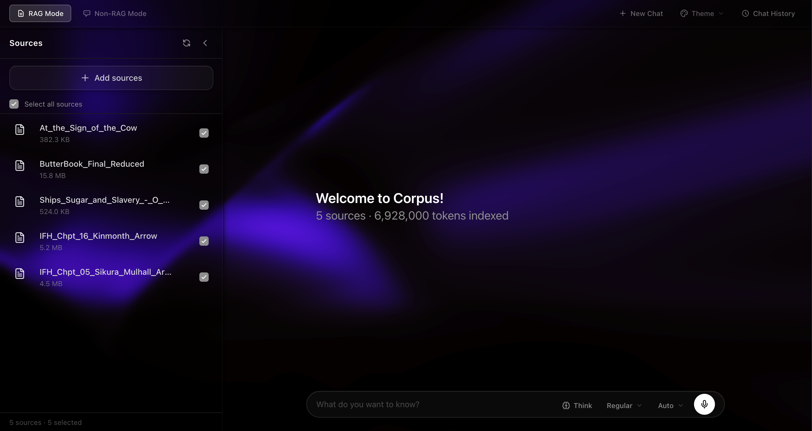
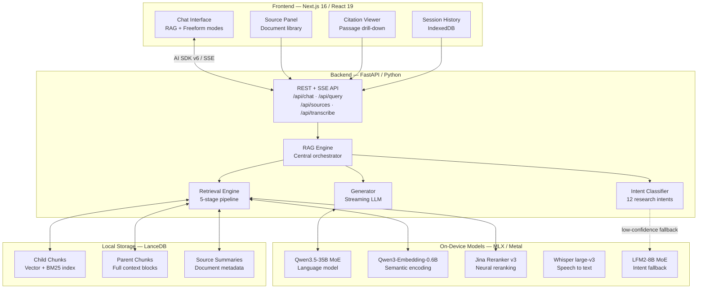
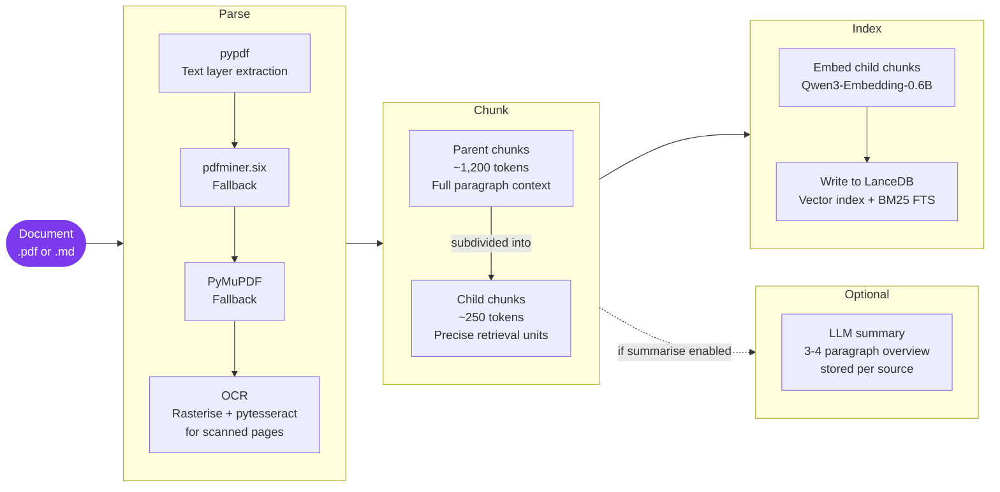
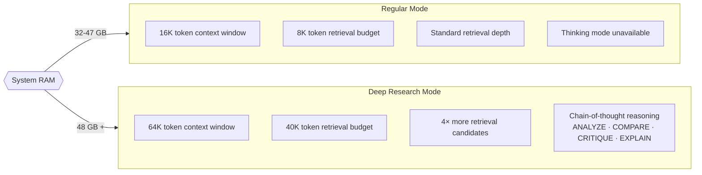
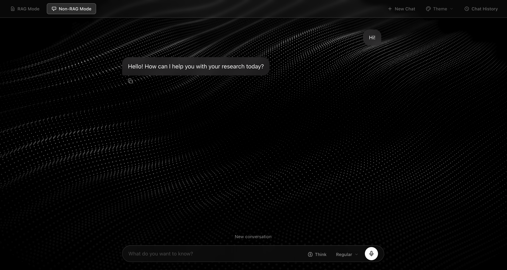
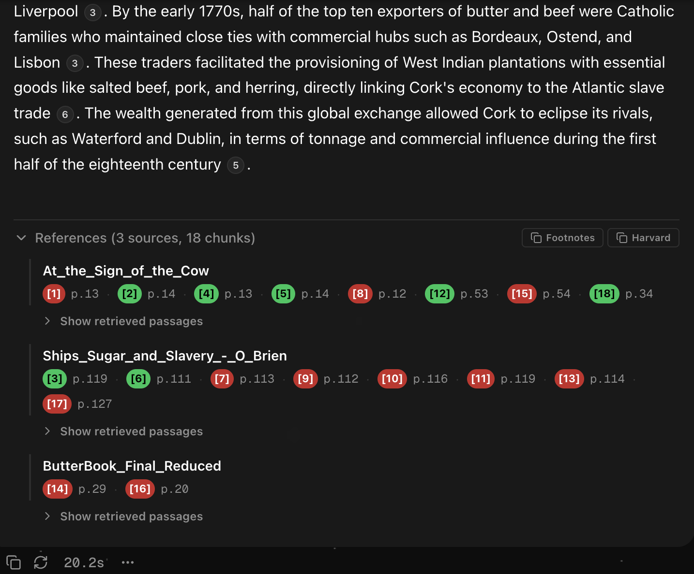

<div align="center">

# Corpus

### A private, offline research assistant for humanities scholarship

*Ask questions of your documents. Receive grounded, cited answers. No data leaves your machine.*



[](https://python.org)
[](https://nextjs.org)
[](https://apple.com/silicon)
[](https://github.com/ml-explore/mlx)
[](https://github.com)
[](https://github.com)

</div>

---

## Overview

Humanities researchers increasingly work with AI tools that require uploading documents to external servers and accepting ongoing cloud dependency. This creates a genuine problem for anyone working with sensitive archival materials, unpublished manuscripts, or embargoed sources.

Corpus runs entirely on your machine. Documents are ingested into a local vector database, queries are answered by a large language model running on your Apple Silicon GPU, and every response is grounded in retrieved passages with inline citations linking to the specific source location and page number. No data leaves your machine, and no internet connection is required after the initial model download.

*Developed as part of a final-year University College Cork Digital Humanities project.*

---

## Capabilities

| Capability | Description |
|---|---|
| **Hybrid retrieval** | Vector ANN semantic search combined with BM25 full-text search, fused via Reciprocal Rank Fusion |
| **Neural reranking** | Jina v3 listwise reranker rescores retrieved passages using a dedicated on-device MLX model |
| **Intent-aware querying** | Twelve research intents with per-intent retrieval depth, prompt instructions, and output format |
| **Inline citations** | Every claim is annotated with passage and page references, linked to a document viewer |
| **Deep Research mode** | Activates chain-of-thought reasoning for analytical intents on systems with 48 GB+ RAM |
| **Offline transcription** | Voice input transcribed locally via Whisper large-v3, with voice activity detection |
| **Freeform chat** | Direct LLM access without retrieval, with persistent session history |
| **Citation export** | Responses exportable as formatted footnotes or Harvard bibliography entries |

---

## Research Intent System

Corpus classifies each query into one of twelve research intents before executing the retrieval pipeline. The classifier uses a heuristic-first approach (regex patterns, structural signals, typo tolerance via difflib) with an LLM fallback when heuristic confidence falls below 0.70. The resolved intent determines retrieval parameters, prompt instructions, and output format. It can be overridden manually from the composer toolbar.

| Intent | Typical triggers | Output format |
|---|---|---|
| `OVERVIEW` | "What is this document about?" | Prose overview |
| `SUMMARIZE` | "Summarise...", "Give me a summary of..." | Structured summary |
| `EXPLAIN` | "Explain...", "What does X mean here?" | Explanation with examples |
| `ANALYZE` | "Analyse...", "What are the implications of..." | Analytical prose |
| `COMPARE` | "Compare...", "How does X differ from Y..." | Structured comparison |
| `CRITIQUE` | "Critique...", "What are the weaknesses of..." | Critical evaluation |
| `FACTUAL` | Specific who / what / when / where questions | Direct factual answer |
| `COLLECTION` | "Which documents cover...", "What sources mention..." | Grouped by document |
| `EXTRACT` | "List every...", "Find all mentions of..." | Numbered list or table |
| `TIMELINE` | "When did...", "Trace the history of..." | `[DATE] - event` format |
| `HOW_TO` | "How do I...", "What are the steps to..." | Numbered procedure |
| `QUOTE_EVIDENCE` | "What does X say about...", "Find quotes on..." | Block-quoted passages |

---

## Architecture



### Query Pipeline

```mermaid
flowchart TD
    Q(["Query"])

    IC["Stage 1: Intent Classification<br/>Heuristic classifier: regex and structural signals<br/>LFM2-8B LLM fallback when confidence below 0.70<br/>Resolves to one of 12 research intents"]

    HS["Stage 2: Hybrid Search<br/>Vector ANN: semantic similarity via Qwen3 embeddings<br/>BM25 full-text: keyword and phrase matching<br/>RRF score fusion combines both ranked lists"]

    RR["Stage 3: Neural Reranking<br/>Jina v3 listwise reranker: single forward pass<br/>Cosine similarity scoring across all candidates<br/>Replaces fusion score with grounded relevance"]

    FI["Stage 4: Filtering and Deduplication<br/>Adaptive threshold: max score scaled at 15%<br/>Parent deduplication: max 2 children per parent<br/>Safety net: guaranteed minimum document count"]

    CE["Stage 5: Context Expansion<br/>Full parent chunk text fetched for each result<br/>Budget-aware fill of available token window<br/>Intent-specific sub-threshold backfill if starved"]

    GA["Stage 6: Answer Generation<br/>Intent-aware prompt assembly: 12 instruction profiles<br/>Qwen3.5-35B streaming generation<br/>Optional chain-of-thought in Deep Research mode"]

    CS["Stage 7: Citation Assembly and Sanitisation<br/>Inline PASSAGE references bound to source metadata<br/>Instruction leakage and chatter phrase removal<br/>Hallucination check: novel proper nouns flagged"]

    A(["Cited answer, streamed to browser"])

    Q --> IC --> HS --> RR --> FI --> CE --> GA --> CS --> A

    style Q fill:#4f46e5,color:#fff,stroke:none
    style A fill:#059669,color:#fff,stroke:none
```



### Document Ingestion



Child chunks (~250 tokens) serve as retrieval units because their specificity improves vector search precision. When a child chunk is retrieved, Corpus fetches the full parent chunk (~1,200 tokens) to pass to the language model, providing the paragraph-level context needed for coherent, accurate generation.


### Operating Modes



Mode is detected automatically from system RAM. In Deep Research mode the four analytical intents (ANALYZE, COMPARE, CRITIQUE, EXPLAIN) activate Qwen3.5's chain-of-thought reasoning; the thinking is hidden from the visible output but substantially improves quality on complex questions.

---

## Interface

The application presents two independently persistent modes, switchable via a tab in the header bar. Both panels remain mounted simultaneously; visibility is toggled via CSS so neither loses state on mode switch.

### RAG Mode

The primary research interface. Queries are processed through the full retrieval pipeline and responses stream token-by-token with inline citation markers ([1], [2], etc.) linking to the specific passage in the source document.

- **Source panel** — lists all ingested documents, supports drag-and-drop upload, and displays optional AI-generated summaries
- **Citation viewer** — opens in place of the source panel when a citation is clicked, fetching the full document and highlighting the cited passage
- **Thinking panel** — displays pipeline events in real time (intent classified, sources retrieved, generation progress) and, in Deep Research mode, the model's reasoning chain
- **Composer** — supports intent override, Deep Research toggle, thinking mode toggle (48 GB+ systems), and offline voice input

### Freeform Mode

A direct conversational interface to the LLM with no retrieval pipeline. Conversation history is maintained within the session and persisted to IndexedDB. Supports thinking mode and generates AI-derived session titles after the first exchange.



### Background Themes

Seven visual themes: `stars`, `meteors`, `rain`, `mesh`, `starfield`, `particles`, and `darkveil`.

---

## Citation System

When citations are enabled, each retrieved passage is wrapped at prompt-construction time:

```
[PASSAGE N | SOURCE: source_id | PAGE: display_page]
... chunk text ...
[PASSAGE END]
```

The model is instructed to cite passages inline as `[N]`. After generation, a `CitationListEvent` is emitted over SSE carrying the full citation metadata; the frontend binds each marker to a Citation object with source ID, chunk ID, and page number.

Clicking a citation badge opens the citation viewer: the full document and the cited chunk are fetched in parallel, and the passage is highlighted in context. An optional citation reference string can be entered per source at ingest time and used when exporting responses as formatted footnotes or Harvard bibliography entries.



---

## Privacy and Local Data

All inference and storage is local. No data is transmitted to external services after the initial model download. The application sets `HF_HUB_OFFLINE=1` automatically once all required models are detected in the local cache.

```
data/
    lance/
        child_chunks/           Vector + BM25 index (retrieval units)
        parent_chunks/          Full context blocks for answer generation
        source_summaries/       Per-document metadata and optional summaries
    source_cache/               Full-text snapshots for the citation viewer
    uploads/                    Uploaded files retained after ingestion
```

---

## Technology Stack

<details>
<summary><strong>Backend</strong></summary>

| Component | Technology | Role |
|---|---|---|
| Language model | mlx-lm / Qwen3.5-35B-A3B (4-bit MoE) | Answer generation, chain-of-thought reasoning |
| Embeddings | mlx-lm / Qwen3-Embedding-0.6B (4-bit DWQ) | Semantic document and query encoding |
| Reranker | jina-reranker-v3-mlx / Qwen3-0.6B + MLP projector | Listwise neural passage reranking |
| Intent classifier | mlx-lm / LFM2-8B-A1B (4-bit MoE) | Intent classification fallback |
| Speech-to-text | mlx-whisper / Whisper large-v3 (4-bit) | Offline audio transcription with VAD |
| Vector database | lancedb + pyarrow | Vector ANN + BM25 FTS with RRF fusion |
| API framework | fastapi + uvicorn | REST endpoints and SSE streaming |
| PDF parsing | pypdf, pdfminer.six, PyMuPDF, pytesseract | Four-strategy fallback chain including OCR |

</details>

<details>
<summary><strong>Frontend</strong></summary>

| Component | Technology | Role |
|---|---|---|
| Framework | Next.js 16 (App Router), React 19, TypeScript 5 | Application shell and routing |
| Chat UI | @assistant-ui/react, AI SDK v6 | Streaming chat with UI Message Stream protocol |
| Markdown | @assistant-ui/react-streamdown, react-markdown | Smooth-streaming markdown with citation rendering |
| Styling | Tailwind CSS 4 | Dark monochrome theme |
| 3D / visual | @react-three/fiber, Three.js | WebGL background themes and particle systems |
| Animations | framer-motion | UI transitions |
| Session storage | IndexedDB | Persistent chat history with reasoning content |
| Citation storage | localStorage | User-provided citation reference strings per source |

</details>

<details>
<summary><strong>On-device models (MLX / Apple Metal)</strong></summary>

All models are 4-bit quantised. After the initial download, no internet connection is required.

| Model | Parameters | Approx. size | Role |
|---|---|---|---|
| NexVeridian/Qwen3.5-35B-A3B-4bit | 35B total / 3B active | ~20 GB | Primary language model |
| mlx-community/Qwen3-Embedding-0.6B-4bit-DWQ | 0.6B | ~350 MB | Document and query embeddings |
| jinaai/jina-reranker-v3-mlx | 0.6B backbone | ~350 MB | Neural passage reranking |
| mlx-community/LFM2-8B-A1B-4bit | 8B total / 1B active | ~4.5 GB | Intent classification fallback |
| mlx-community/whisper-large-v3-4bit | Large-v3 | ~800 MB | Speech-to-text transcription |

</details>

## Installation

> **System requirements:** Apple Silicon Mac (M1 or later), macOS 13+, minimum 32 GB unified memory (48 GB recommended for Deep Research mode and thinking features). Python 3.11+ and Node.js 18+ are required.

### 1. Clone the repository

```bash
git clone https://github.com/mc32452/dh-notebook-offline.git
cd dh-notebook-offline
```

### 2. Set up the Python environment

```bash
python3 -m venv .venv
source .venv/bin/activate
pip install -r requirements.txt
```

### 3. Install frontend dependencies

```bash
cd frontend
npm install
cd ..
```

### 4. Download AI models

Models are downloaded automatically from Hugging Face on first use. You can also pre-download them all at once with the commands below, which is recommended so startup does not stall on a slow connection:

```bash
source .venv/bin/activate

# Primary language model (~20 GB)
python -c "from mlx_lm import load; load('NexVeridian/Qwen3.5-35B-A3B-4bit')"

# Embedding model (~350 MB)
python -c "from mlx_lm import load; load('mlx-community/Qwen3-Embedding-0.6B-4bit-DWQ')"

# Intent classifier (~4.5 GB)
python -c "from mlx_lm import load; load('mlx-community/LFM2-8B-A1B-4bit')"

# Reranker (~350 MB)
python -c "from mlx_lm import load; load('jinaai/jina-reranker-v3-mlx')"

# Whisper speech recognition (~800 MB)
python -c "import mlx_whisper; print('Whisper ready')"
```

> **Total download: approximately 26 GB**, of which the primary language model (~20 GB) accounts for the bulk. Models are cached in `~/.cache/huggingface/` — no further internet access is needed after this one-time download.


---

## Usage

### Starting the application

```bash
# Start the backend API server
source .venv/bin/activate
uvicorn src.api:app --host 127.0.0.1 --port 8000

# In a separate terminal, start the frontend
cd frontend && npm run dev
```

Open http://localhost:3000 in your browser.

### CLI

```bash
# Ingest a document
python -m src.cli ingest docs/paper.pdf --source-id my_paper --summarize

# Query with automatic intent detection
python -m src.cli query "What is the central argument?" --cite

# Query with a specific intent in Deep Research mode
python -m src.cli query "Compare the two theoretical frameworks" \
  --intent compare --mode deep-research

# Inspect the exact prompt sent to the model
python -m src.cli query "Explain this concept" --dump-prompt

# Print retrieval and generation latency report
python -m src.cli query "Analyse the methodology" --latency
```

### API

```bash
# Health check
curl http://127.0.0.1:8000/api/health

# Streamed query via SSE
curl -N -H "Content-Type: application/json" \
  -d '{"query":"Compare these views","stream":true,"mode":"regular","citations_enabled":true}' \
  http://127.0.0.1:8000/api/query

# Upload a document
curl -F "file=@paper.pdf" -F "source_id=my_paper" -F "summarize=true" \
  http://127.0.0.1:8000/api/sources/upload
```

### Phoenix Observability (Arize)

Corpus now includes native Phoenix tracing for:

- Intent classification
- Retrieval stage pipeline (hybrid search, rerank, dedup, threshold filter, budget expand, context expansion)
- Token budget packing
- Prompt construction
- LLM generation (synchronous and streaming)
- Benchmark retrieval-mode traces (`hybrid_rrf`, `vector_only`, `bm25_only`)

Enable tracing via environment variables:

```bash
export RAG_PHOENIX_ENABLED=1
export PHOENIX_PROJECT_NAME=corpus-local
export PHOENIX_COLLECTOR_ENDPOINT=http://127.0.0.1:6006/v1/traces
```

Optional cloud auth:

```bash
export PHOENIX_API_KEY=your-api-key
```

CLI overrides are also available on `query`, `ingest`, `benchmark`, and retrieval-only benchmark commands:

```bash
python -m src.cli query "Compare these arguments" --phoenix --phoenix-project corpus-cli

python -m src.benchmark.retrieval_only benchmarks/ground_truth/bm25vsvector.json \
    --phoenix --phoenix-project corpus-retrieval-bench
```

Check runtime tracing status from health:

```bash
curl http://127.0.0.1:8000/api/health
```

Health responses now include `phoenix_configured`, `phoenix_active`, `phoenix_project_name`, and `phoenix_endpoint`.

---

## Project Structure

<details>
<summary><strong>Backend (src/)</strong></summary>

| File | Lines | Purpose |
|---|---|---|
| api.py | 1,317 | FastAPI endpoints, SSE streaming, engine hot-swap, freeform chat |
| rag_engine.py | 1,671 | Central orchestrator: query pipeline, ingest pipeline, output sanitisation |
| retrieval.py | 697 | 5-stage hybrid retrieval pipeline with intent-scaled parameters |
| generator.py | 945 | MLX text generation, streaming, token budget packing, presence penalty |
| intent.py | 963 | Heuristic and LLM intent classifier: 12 intents, typo tolerance |
| generation.py | 573 | Intent-aware prompt construction: 12 instruction profiles across 2 mode variants |
| storage.py | 737 | LanceDB vector and FTS storage, schema migration, cascading delete |
| ingest.py | 557 | PDF and Markdown parsing, hierarchical parent/child chunking |
| reranker.py | 423 | Jina v3 MLX listwise reranker with MLP projector |
| config.py | 364 | Mode configurations, RAM detection, per-intent retrieval and generation overrides |
| transcription.py | 590 | MLX Whisper with pure-NumPy voice activity detection |
| embeddings.py | 173 | MLX embedding model wrapper: mean pooling, L2 normalisation |
| stream_protocol.py | 251 | AI SDK v6 UI Message Stream encoder (SSE frames) |
| query_events.py | 96 | Pipeline event dataclasses: 8 event types |
| source_cache.py | 176 | Full-text snapshot caching for the citation viewer |
| metrics.py | 170 | Retrieval and budget metrics: 6 dataclasses |
| latency.py | 107 | Zero-cost latency profiler with ASCII chart output |
| cli.py | 390 | CLI entry point: ingest and query commands |

</details>

<details>
<summary><strong>Frontend (frontend/src/)</strong></summary>

| File | Purpose |
|---|---|
| app/page.tsx | Entry point, dual-mode always-mounted layout, theme picker |
| app/api/chat/route.ts | Next.js streaming proxy to backend (unbuffered SSE) |
| context/app-context.tsx | Global state: useReducer, 13 action types, dual-context pattern |
| context/theme-context.tsx | Background theme state: 7 themes, localStorage persistence |
| components/source-panel.tsx | Document library: sequential upload queue, drag-and-drop |
| components/freeform-chat-panel.tsx | Freeform streaming chat: model and thinking selection, AI-generated titles |
| components/citation-viewer-modal.tsx | Inline citation reader: parallel content and chunk fetch |
| components/history-panel.tsx | Session history drawer: debounced search, glassmorphism styling |
| components/assistant-ui/thread.tsx | Chat thread: composer with model, intent, think, and speech controls |
| components/assistant-ui/thinking-panel.tsx | Pipeline status steps and streaming reasoning display |
| components/assistant-ui/message-references.tsx | Citation drawer: cited/uncited badges, lazy chunk loading, citation export |
| lib/session-store.ts | IndexedDB session persistence with reasoning content |
| lib/format-citations.ts | Footnote and Harvard citation formatters with marker renumbering |
| lib/text-highlighter.ts | DOM TreeWalker exact substring match and `<mark>` injection |
| hooks/useSpeechToText.ts | Offline voice input: MediaRecorder, VAD, silence detection |
| hooks/useSystemRam.ts | RAM detection via /api/health: gates Deep Research and Think toggle |

</details>

---